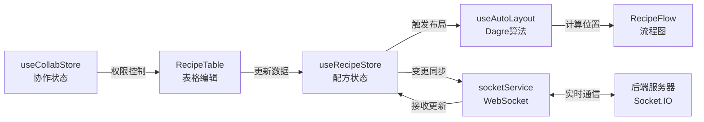

# AI 导航速查

> 给 AI 助手和开发者的快速技术导航指南

## 1. 功能-文件映射表（核心）

| 功能分类 | 文件路径 | 关键标识 |
|---------|---------|---------|
| **编辑器组件** | | |
| 数据表格 | `src/components/editor/RecipeTable.tsx` | `RecipeTable` 组件 |
| 连接管理 | `src/components/editor/ConnectionModal.tsx` | `ConnectionModal` 组件 |
| **流程图组件** | | |
| 图视图 | `src/components/graph/RecipeFlow.tsx` | `RecipeFlow` 组件 |
| 自定义节点 | `src/components/graph/CustomNode.tsx` | `CustomNode` 组件 |
| 自定义连线 | `src/components/graph/SequenceEdge.tsx` | `SequenceEdge` 组件 |
| **布局组件** | | |
| 应用布局 | `src/components/layout/AppLayout.tsx` | `AppLayout` 组件 |
| **协作组件** | | |
| 编辑锁按钮 | `src/components/collab/EditLockButton.tsx` | 申请/释放编辑权限 |
| 在线用户 | `src/components/collab/OnlineUsers.tsx` | 显示在线用户列表 |
| 演示模式 | `src/components/collab/DemoModeButton.tsx` | 切换演示模式 |
| 状态栏 | `src/components/collab/StatusBar.tsx` | 显示连接状态 |
| **状态管理** | | |
| 配方数据 | `src/store/useRecipeStore.ts` | `useRecipeStore` - nodes, edges, metadata |
| 协作状态 | `src/store/useCollabStore.ts` | `useCollabStore` - 编辑锁、在线用户 |
| **Hooks** | | |
| 自动布局 | `src/hooks/useAutoLayout.ts` | `useAutoLayout` - Dagre 布局算法 |
| 实时同步 | `src/hooks/useSocketSync.ts` | `useSocketSync` - WebSocket 同步 |
| 编辑锁 | `src/hooks/useEditLock.ts` | `useEditLock` - 编辑权限管理 |
| 自动保存 | `src/hooks/useAutoSave.ts` | `useAutoSave` - 定期保存 |
| 演示模式 | `src/hooks/useDemoMode.ts` | `useDemoMode` - 演示模式逻辑 |
| 心跳检测 | `src/hooks/useHeartbeat.ts` | `useHeartbeat` - 连接心跳 |
| **服务层** | | |
| WebSocket | `src/services/socketService.ts` | `socketService` - Socket.IO 封装 |
| **类型定义** | | |
| 配方类型 | `src/types/recipe.ts` | `RecipeSchema`, `RecipeNode`, `RecipeEdge`, `ProcessNodeData` |
| **初始数据** | | |
| 初始数据 | `src/data/initialData.ts` | `initialNodes`, `initialEdges` |
| **后端** | | |
| 服务器入口 | `server/src/index.ts` | Express + Socket.IO 服务器 |
| 数据库 | `server/src/db.ts` | SQLite 数据库操作 |
| 锁管理 | `server/src/lockManager.ts` | 编辑锁管理逻辑 |
| 用户管理 | `server/src/userManager.ts` | 在线用户管理 |

## 2. 目录结构速览

```
src/
├── components/        # React 组件
│   ├── editor/       # 编辑器组件（表格、连接管理）
│   ├── graph/        # 流程图组件（节点、连线、视图）
│   ├── collab/       # 协作功能组件（编辑锁、在线用户等）
│   ├── layout/       # 布局组件（应用主布局）
│   └── ui/           # Shadcn UI 基础组件
├── hooks/            # 自定义 Hooks（布局、同步、锁等）
├── store/            # Zustand 状态管理
├── services/         # 服务层（WebSocket）
├── types/            # TypeScript 类型定义
└── data/             # 初始数据

server/
└── src/              # 后端服务器代码
```

## 3. 核心概念

### 状态管理（Zustand）

- **useRecipeStore**：管理配方数据（nodes、edges、metadata）
  - 核心方法：`addNode`, `updateNode`, `removeNode`, `addEdge`, `setNodes`, `setEdges`
  - 导入导出：`exportJSON`, `importJSON`
  - 服务器同步：`syncFromServer`

- **useCollabStore**：管理协作状态（编辑锁、在线用户、模式）
  - 模式：`view`（查看）、`edit`（编辑）、`demo`（演示）
  - 编辑锁：`lockStatus`（是否锁定、锁定者信息）
  - 在线用户：`onlineUsers` 数组

### React Flow 集成

- **自定义节点**：`CustomNode` - 显示工艺步骤信息（ID、名称、设备、原料、参数）
- **自定义连线**：`SequenceEdge` - 带序号标识的连线（显示投料顺序）
- **自动布局**：使用 Dagre 算法，方向 Top-to-Bottom

### WebSocket 实时同步

- **服务**：`socketService` - Socket.IO 客户端封装
- **Hook**：`useSocketSync` - 监听服务器事件，同步配方数据
- **事件**：`recipe:updated`（配方更新）、`lock:acquired`（锁获取）、`user:joined`（用户加入）等

## 4. 数据流架构



## 5. 数据类型速查

### RecipeSchema（根对象）
```typescript
{
  metadata: { name, version, updatedAt },
  nodes: RecipeNode[],
  edges: RecipeEdge[]
}
```

### RecipeNode（节点）
```typescript
{
  id: string,              // 如 "P1"
  type: 'customProcessNode',
  data: ProcessNodeData,   // 可辨识联合类型
  position: { x, y }       // 由 Dagre 计算
}
```

### ProcessNodeData（工艺节点数据）
可辨识联合类型，包含 6 种工艺类型：
- `DISSOLUTION`（溶解）- `dissolutionParams`
- `COMPOUNDING`（调配）- `compoundingParams`
- `FILTRATION`（过滤）- `filtrationParams`
- `TRANSFER`（赶料）- `transferParams`
- `FLAVOR_ADDITION`（香精添加）- `flavorAdditionParams`
- `OTHER`（其他）- `params: string`

### RecipeEdge（连线）
```typescript
{
  id: string,              // 如 "e_P1-P6"
  source: string,          // 源节点 ID
  target: string,          // 目标节点 ID
  type: 'sequenceEdge',
  data: { sequenceOrder: number }  // 投料顺序（1, 2, 3...）
}
```

## 6. 常见任务速查

### 修改自动布局算法
- 文件：`src/hooks/useAutoLayout.ts`
- 配置：`LAYOUT_CONFIG` 对象（节点尺寸、间距、居中策略）
- 算法：Dagre 库，方向 `TB`（Top-to-Bottom）

### 添加新工艺类型
1. 在 `src/types/recipe.ts` 添加新的 `ProcessType` 枚举值
2. 定义对应的参数接口（如 `NewTypeParams`）
3. 在 `ProcessNodeData` 联合类型中添加新分支
4. 在 `CustomNode.tsx` 中添加渲染逻辑
5. 在 `useAutoLayout.ts` 的 `estimateNodeHeight` 中添加高度估算

### 修改节点样式
- 文件：`src/components/graph/CustomNode.tsx`
- 样式：Tailwind CSS 类名
- 结构：Header（橙色背景）+ Body（白色背景）

### 调整协作功能
- 编辑锁：`src/hooks/useEditLock.ts` + `server/src/lockManager.ts`
- 自动保存：`src/hooks/useAutoSave.ts`
- 心跳检测：`src/hooks/useHeartbeat.ts`

---

**提示**：详细的使用说明请参考 `README.md`，本文档专注于技术导航。
