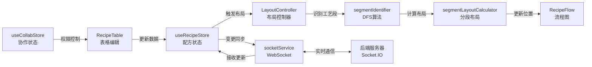

# AI 导航速查

> 给 AI 助手和开发者的快速技术导航指南

## 📌 重要更新（2026-01）

### 布局算法架构重构
- ✅ **新架构**：从 Dagre 库迁移到自研的**工艺段识别 + 分段布局**算法
- ✅ **核心文件**：
  - `LayoutController.tsx` - Headless 布局控制器（替代 `useAutoLayout.ts`）
  - `segmentIdentifier.ts` - DFS 工艺段识别算法
  - `segmentLayoutCalculator.ts` - 分段布局计算器
- ✅ **新特性**：
  - 固定连线长度（120px）
  - 汇聚点智能居中（加权质心算法）
  - 调试模式可视化（连线长度标注、误差高亮）
- 📖 **详细文档**：参考 `AUTO_LAYOUT_ALGORITHM.md`

### 动态字段配置系统
- ✅ **数据库驱动**：字段定义存储在 SQLite，前端动态渲染
- ✅ **核心组件**：
  - `DynamicFormRenderer` - 动态表单渲染引擎
  - `FieldConfigEditor` - 字段配置编辑器
  - `useFieldConfigStore` - 字段配置状态管理
- ✅ **支持类型**：Text, Number, Select, Array, Object, Range 等

---

## 1. 功能-文件映射表（核心）

| 功能分类 | 文件路径 | 关键标识 |
|---------|---------|---------|
| **编辑器组件** | | |
| 数据表格 | `src/components/editor/RecipeTable.tsx` | `RecipeTable` 组件 |
| 连接管理 | `src/components/editor/ConnectionModal.tsx` | `ConnectionModal` 组件 |
| 添加子步骤 | `src/components/editor/AddSubStepDialog.tsx` | `AddSubStepDialog` 组件 |
| 参数配置 | `src/components/editor/ParamsModal.tsx` | `ParamsModal` 组件 |
| 粘贴选项 | `src/components/editor/PasteOptionsDialog.tsx` | `PasteOptionsDialog` 组件 |
| **流程图组件** | | |
| 图视图 | `src/components/graph/RecipeFlow.tsx` | `RecipeFlow` 组件 |
| 自定义节点 | `src/components/graph/CustomNode.tsx` | `CustomNode` 组件 |
| 自定义连线 | `src/components/graph/SequenceEdge.tsx` | `SequenceEdge` 组件 |
| 布局控制器 | `src/components/graph/LayoutController.tsx` | `LayoutController` - Headless 布局组件 |
| 调试叠加层 | `src/components/graph/DebugOverlay.tsx` | 调试模式可视化 |
| 调试统计面板 | `src/components/graph/DebugStatsPanel.tsx` | 布局统计信息 |
| **布局组件** | | |
| 应用布局 | `src/components/layout/AppLayout.tsx` | `AppLayout` 组件 |
| **协作组件** | | |
| 编辑锁按钮 | `src/components/collab/EditLockButton.tsx` | 申请/释放编辑权限 |
| 在线用户 | `src/components/collab/OnlineUsers.tsx` | 显示在线用户列表 |
| 演示模式 | `src/components/collab/DemoModeButton.tsx` | 切换演示模式 |
| 状态栏 | `src/components/collab/StatusBar.tsx` | 显示连接状态 |
| **配置组件** | | |
| 配置页面 | `src/components/config/ConfigPage.tsx` | `ConfigPage` 组件 - 工艺类型配置 |
| 字段配置 | `src/components/config/FieldConfigEditor.tsx` | `FieldConfigEditor` - 动态字段定义编辑器 |
| **动态表单** | | |
| 表单渲染器 | `src/components/common/DynamicForm/DynamicFormRenderer.tsx` | `DynamicFormRenderer` - 基于配置生成表单 |
| 字段组件 | `src/components/common/DynamicForm/fields/` | 各类字段组件 (`ArrayField`, `ObjectField` 等) |
| **调度组件** | | |
| 甘特图视图 | `src/components/scheduling/GanttView.tsx` | `GanttView` 组件 - 设备调度甘特图 |
| 设备状态面板 | `src/components/scheduling/DeviceStatusPanel.tsx` | `DeviceStatusPanel` 组件 |
| **状态管理** | | |
| 配方数据 | `src/store/useRecipeStore.ts` | `useRecipeStore` - nodes, edges, metadata |
| 协作状态 | `src/store/useCollabStore.ts` | `useCollabStore` - 编辑锁、在线用户 |
| 工艺类型配置 | `src/store/useProcessTypeConfigStore.ts` | `useProcessTypeConfigStore` - 子步骤和工艺段模板 |
| 字段配置 | `src/store/useFieldConfigStore.ts` | `useFieldConfigStore` - 动态字段定义管理 |
| **Hooks** | | |
| 工艺段识别 | `src/hooks/segmentIdentifier.ts` | `identifyProcessSegments` - DFS 算法识别并行/串行段 |
| 分段布局计算 | `src/hooks/segmentLayoutCalculator.ts` | `layoutParallelSegments`, `layoutSerialSegments` - 布局算法 |
| 实时同步 | `src/hooks/useSocketSync.ts` | `useSocketSync` - WebSocket 同步 |
| 编辑锁 | `src/hooks/useEditLock.ts` | `useEditLock` - 编辑权限管理 |
| 自动保存 | `src/hooks/useAutoSave.ts` | `useAutoSave` - 定期保存 |
| 演示模式 | `src/hooks/useDemoMode.ts` | `useDemoMode` - 演示模式逻辑 |
| 心跳检测 | `src/hooks/useHeartbeat.ts` | `useHeartbeat` - 连接心跳 |
| **服务层** | | |
| WebSocket | `src/services/socketService.ts` | `socketService` - Socket.IO 封装 |
| 调度器 | `src/services/scheduler.ts` | `calculateSchedule`, `calculateScheduleWithContext` - 设备调度算法 |
| 工厂配置 | `src/services/factoryConfigService.ts` | `factoryConfigService` - 工厂和产线配置管理 |
| 操作模板 | `src/services/operationTemplates.ts` | 操作模板服务 |
| 字段配置 | `src/services/fieldConfigService.ts` | `fieldConfigService` - 字段配置 CRUD |
| **路由** | | |
| 路由配置 | `src/router.tsx` | React Router 路由配置 |
| **类型定义** | | |
| 配方类型 | `src/types/recipe.ts` | `RecipeSchema`, `RecipeNode`, `RecipeEdge`, `ProcessNodeData` |
| 设备类型 | `src/types/equipment.ts` | `DeviceType`, `EquipmentSpec` |
| 物料类型 | `src/types/material.ts` | 物料相关类型定义 |
| 操作类型 | `src/types/operation.ts` | 操作相关类型定义 |
| 调度结果 | `src/types/scheduling.ts` | `ScheduleResult` - 包含时间线、设备状态、总耗时、警告等信息 |
| 工艺类型配置 | `src/types/processTypeConfig.ts` | `SubStepTemplate`, `ProcessSegmentTemplate` |
| 字段配置类型 | `src/types/fieldConfig.ts` | `FieldConfig` - 动态字段配置类型定义 |
| **初始数据** | | |
| 初始数据 | `src/data/initialData.ts` | `initialNodes`, `initialEdges` |
| 设备池 | `src/data/devicePool.ts` | `defaultDevicePool` - 默认设备资源池 |
| **工具函数** | | |
| 迁移工具 | `src/utils/migration.ts` | 数据迁移工具 |
| 字段提取器 | `src/utils/fieldExtractor.ts` | 从配方数据中提取字段定义 |
| 字段验证器 | `src/utils/fieldValidator.ts` | 字段验证逻辑 |
| 字段同步工具 | `src/utils/syncFieldsFromRecipes.ts` | 从配方同步字段到数据库 |
| **后端** | | |
| 服务器入口 | `server/src/index.ts` | Express + Socket.IO 服务器 |
| 数据库 | `server/src/db.ts` | SQLite 数据库操作 |
| 锁管理 | `server/src/lockManager.ts` | 编辑锁管理逻辑 |
| 用户管理 | `server/src/userManager.ts` | 在线用户管理 |
| 类型定义 | `server/src/types.ts` | 服务器端类型定义 |

## 2. 目录结构速览

```
src/
├── components/        # React 组件
│   ├── editor/       # 编辑器组件（表格、连接管理、对话框）
│   ├── graph/        # 流程图组件（节点、连线、视图、布局控制器）
│   ├── collab/       # 协作功能组件（编辑锁、在线用户等）
│   ├── layout/       # 布局组件（应用主布局）
│   ├── config/       # 配置页面组件（工艺类型配置、字段配置）
│   ├── scheduling/   # 调度相关组件（甘特图、设备状态）
│   ├── common/       # 通用组件（动态表单渲染器、字段组件）
│   └── ui/           # Shadcn UI 基础组件
├── hooks/            # 自定义 Hooks（工艺段识别、布局计算、同步、锁等）
├── store/            # Zustand 状态管理
├── services/         # 服务层（WebSocket、调度器、工厂配置、字段配置）
├── types/            # TypeScript 类型定义
├── data/             # 初始数据（配方、设备池）
├── utils/            # 工具函数（迁移、字段提取、验证等）
└── router.tsx        # React Router 路由配置

server/
└── src/              # 后端服务器代码
```

## 3. 核心概念

### 状态管理（Zustand）

- **useRecipeStore**：管理配方数据（nodes、edges、metadata）
  - 核心方法：`addNode`, `updateNode`, `removeNode`, `addEdge`, `setNodes`, `setEdges`
  - 导入导出：`exportJSON`, `importJSON`
  - 服务器同步：`syncFromServer`

- **useCollabStore**：管理协作状态（编辑锁、在线用户、模式）
  - 模式：`view`（查看）、`edit`（编辑）、`demo`（演示）
  - 编辑锁：`lockStatus`（是否锁定、锁定者信息）
  - 在线用户：`onlineUsers` 数组

### React Flow 集成

- **自定义节点**：`CustomNode` - 显示工艺步骤信息（ID、名称、设备、原料、参数）
- **自定义连线**：`SequenceEdge` - 带序号标识的连线（显示投料顺序）
- **自动布局**：采用**工艺段识别 + 分段布局**策略，固定连线长度 120px
  - 工艺段识别：使用 DFS 算法识别并行段和串行段
  - 并行段布局：所有分支起点对齐，段内连线长度统一
  - 汇聚点居中：基于子树规模的加权质心算法
  - 串行段布局：从汇聚点垂直向下，连线长度统一
- **调试模式**：可视化显示连线长度和误差，快速定位布局问题

### WebSocket 实时同步

- **服务**：`socketService` - Socket.IO 客户端封装
- **Hook**：`useSocketSync` - 监听服务器事件，同步配方数据
- **事件**：`recipe:updated`（配方更新）、`lock:acquired`（锁获取）、`user:joined`（用户加入）等

### 路由系统（React Router）

- **路由配置**：`src/router.tsx` - 定义应用路由
- **路由页面**：
  - `/` - 主编辑器页面（`App` 组件）
  - `/config` - 工艺类型配置页面（`ConfigPage` 组件）

### 工艺类型配置管理

- **状态管理**：`useProcessTypeConfigStore` - 管理子步骤模板和工艺段模板
- **配置页面**：`ConfigPage` - 可视化配置界面，支持编辑子步骤类型和工艺段类型
- **模板类型**：
  - `SubStepTemplate` - 子步骤类型模板（默认名称、设备、描述）
  - `ProcessSegmentTemplate` - 工艺段类型模板（默认子步骤序列）

### 设备调度系统

- **调度算法**：`scheduler.ts` - 计算设备占用时间线，支持依赖关系和设备分配
- **工厂配置**：`factoryConfigService.ts` - 管理工厂和产线配置，支持研发视图和生产视图
- **设备资源**：`devicePool.ts` - 定义设备资源池，包含设备类型、容量、状态等信息
- **甘特图视图**：`GanttView` - 可视化显示设备调度时间线，支持缩放和视图切换
- **调度结果**：`ScheduleResult` - 包含时间线、设备状态、总耗时、警告等信息

### 动态字段配置系统

- **核心思想**：数据库驱动的字段定义，实现配置即代码。
- **状态管理**：`useFieldConfigStore` - 从后端同步字段定义 (`FieldConfig`)。
- **渲染引擎**：`DynamicFormRenderer` - 读取配置，动态渲染对应的字段组件。
- **字段类型**：
  - 基础类型：Text, Number, Select
  - 复杂类型：Array (多值), Object (嵌套结构)
  - 逻辑控制：支持条件显示 (Conditional Rendering) 和验证规则 (Validation)
- **数据流**：前端编辑配置 -> API -> SQLite (field_definitions 表) -> 前端 Store -> 动态表单组件

## 4. 数据流架构



## 5. 数据类型速查

### RecipeSchema（根对象）
```typescript
{
  metadata: { name, version, updatedAt },
  nodes: RecipeNode[],
  edges: RecipeEdge[]
}
```

### RecipeNode（节点）
```typescript
{
  id: string,              // 如 "P1"
  type: 'customProcessNode',
  data: ProcessNodeData,   // 可辨识联合类型
  position: { x, y }       // 由 Dagre 计算
}
```

### ProcessNodeData（工艺节点数据）
可辨识联合类型，包含 6 种工艺类型：
- `DISSOLUTION`（溶解）- `dissolutionParams`
- `COMPOUNDING`（调配）- `compoundingParams`
- `FILTRATION`（过滤）- `filtrationParams`
- `TRANSFER`（赶料）- `transferParams`
- `FLAVOR_ADDITION`（香精添加）- `flavorAdditionParams`
- `OTHER`（其他）- `params: string`

### RecipeEdge（连线）
```typescript
{
  id: string,              // 如 "e_P1-P6"
  source: string,          // 源节点 ID
  target: string,          // 目标节点 ID
  type: 'sequenceEdge',
  data: { sequenceOrder: number }  // 投料顺序（1, 2, 3...）
}
```

## 6. 常见任务速查

### 修改自动布局算法
- **主控制器**：`src/components/graph/LayoutController.tsx` - 布局流程控制、节点尺寸收集、坐标转换
- **工艺段识别**：`src/hooks/segmentIdentifier.ts` - DFS 算法识别并行段和串行段
- **分段布局计算**：`src/hooks/segmentLayoutCalculator.ts` - 并行段、串行段、汇聚点的布局算法
- **配置参数**：
  - `TARGET_EDGE_LENGTH`: 120 (目标连线长度)
  - `PROCESS_LANE_WIDTH`: 300 (工艺段车道宽度)
  - `LANE_GAP`: 64 (车道间隙)
  - `START_X`: 150 (起始X偏移)
- **调试工具**：
  - `DebugOverlay.tsx` - 可视化连线长度和误差
  - `DebugStatsPanel.tsx` - 布局统计信息
- **详细文档**：参考 `AUTO_LAYOUT_ALGORITHM.md` 了解完整算法原理

### 添加新工艺类型
1. 在 `src/types/recipe.ts` 添加新的 `ProcessType` 枚举值
2. 定义对应的参数接口（如 `NewTypeParams`）
3. 在 `ProcessNodeData` 联合类型中添加新分支
4. 在 `CustomNode.tsx` 中添加渲染逻辑
5. 节点高度由 React Flow 自动测量，无需手动配置

### 修改节点样式
- 文件：`src/components/graph/CustomNode.tsx`
- 样式：Tailwind CSS 类名
- 结构：Header（橙色背景）+ Body（白色背景）

### 调整协作功能
- 编辑锁：`src/hooks/useEditLock.ts` + `server/src/lockManager.ts`
- 自动保存：`src/hooks/useAutoSave.ts`
- 心跳检测：`src/hooks/useHeartbeat.ts`

### 修改调度算法
- 文件：`src/services/scheduler.ts`
- 核心函数：`calculateSchedule`、`calculateScheduleWithContext`
- 设备分配：`allocateDevice` - 支持指定设备编号或设备类型
- 依赖处理：`checkDependencies`、`calculateStartTime` - 处理步骤依赖关系

### 配置工艺类型模板
- 状态管理：`src/store/useProcessTypeConfigStore.ts`
- 配置页面：`src/components/config/ConfigPage.tsx`
- 模板定义：`src/types/processTypeConfig.ts`
- 默认模板：`DEFAULT_SUBSTEP_TEMPLATES`、`DEFAULT_PROCESS_SEGMENT_TEMPLATES`

### 修改工厂配置
- 服务：`src/services/factoryConfigService.ts`
- 配置级别：`ConfigurationLevel` - RECIPE（研发视图）、PRODUCTION_LINE（生产视图）
- 设备池：`src/data/devicePool.ts` - 定义默认设备资源

### 使用调试模式
- **启用方式**：
  - 点击流程图右上角的调试按钮
  - 或在控制台执行：`localStorage.setItem('debug_layout', 'true')`
- **显示内容**：
  - 连线长度标注（实际长度 + 误差）
  - 颜色编码：绿色（<5px）、黄色（5-10px）、红色（>10px）
  - 悬停显示详细信息
- **组件位置**：
  - `DebugOverlay.tsx` - 调试叠加层
  - `DebugStatsPanel.tsx` - 统计面板

### 配置动态字段
- **访问配置页面**：浏览器访问 `/config`，切换到"字段配置"标签
- **字段类型**：Text, Number, Select, Array, Object, Range 等
- **配置项**：
  - 字段类型、标签、默认值
  - 验证规则（必填、最小值、最大值等）
  - 条件显示规则
- **核心文件**：
  - `FieldConfigEditor.tsx` - 配置编辑器
  - `DynamicFormRenderer.tsx` - 表单渲染引擎
  - `useFieldConfigStore.ts` - 状态管理

---

**提示**：详细的使用说明请参考 `README.md`，本文档专注于技术导航。
完整的布局算法文档请参考 `AUTO_LAYOUT_ALGORITHM.md`。
