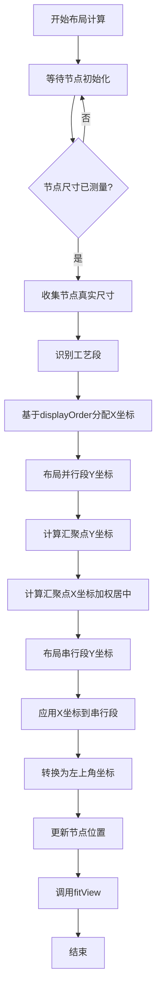
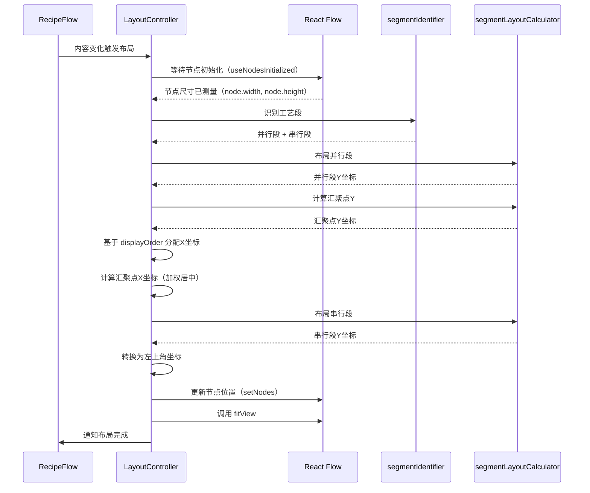

# 自动布局算法详细文档

## 目录

1. [概述](#概述)
2. [实现状态总览](#实现状态总览)
3. [技术路线](#技术路线)
4. [算法架构](#算法架构)
5. [核心算法详解](#核心算法详解)
6. [节点尺寸计算](#节点尺寸计算)
7. [精确高度计算](#精确高度计算)
8. [调试模式](#调试模式)
9. [数据存储格式](#数据存储格式)
10. [代码实现细节](#代码实现细节)
11. [性能优化](#性能优化)
12. [实现状态说明](#实现状态说明)

---

## 概述

本系统实现了一个智能的工艺流程图自动布局算法，用于自动计算和排列配方工艺流程图中的节点位置。算法采用**工艺段识别 + 分段布局**的策略，能够处理复杂的并行-串行混合流程，确保连线长度均匀、视觉美观。

### 核心特性

- ✅ **工艺段自动识别**：自动识别并行工艺段和串行工艺段
- ✅ **分段布局计算**：并行段和串行段采用不同的布局策略
- ✅ **固定连线长度**：确保所有连线长度统一（目标值：120px）
- ⚠️ **节点尺寸计算**：使用 React Flow 自动测量的真实尺寸（非 Canvas API）
- ✅ **分档宽度策略**：根据输入数量动态计算节点宽度（在 CustomNode 中实现）
- ✅ **水平对齐优化**：基于 `displayOrder` 的水平对齐
- ✅ **汇聚点智能居中**：多输入节点的加权居中算法
- ✅ **调试模式**：可视化显示连线长度和误差，快速定位布局问题

---

## 实现状态总览

| 功能模块 | 实现状态 | 说明 |
|---------|---------|------|
| **工艺段识别** | ✅ 已实现 | `segmentIdentifier.ts` - 使用 DFS 算法识别并行/串行段 |
| **并行段布局** | ✅ 已实现 | `layoutParallelSegments` - 固定连线长度 120px |
| **串行段布局** | ✅ 已实现 | `layoutSerialSegments` - 从汇聚点向下排列 |
| **汇聚点Y坐标计算** | ✅ 已实现 | `calculateConvergenceY` - 支持 max/weighted/median 策略 |
| **汇聚点X坐标居中** | ✅ 已实现 | 加权质心算法，基于子树规模 |
| **基于 displayOrder 的水平布局** | ✅ 已实现 | 每个 Process 分配一个水平车道 |
| **分档宽度计算** | ✅ 已实现 | `CustomNode.tsx` 中的 `getTieredWidth` 函数 |
| **节点尺寸获取** | ✅ 已实现 | 使用 React Flow 自动测量的 `node.width` 和 `node.height` |
| **调试模式** | ✅ 已实现 | `DebugOverlay.tsx` 和 `DebugStatsPanel.tsx` |
| **Canvas API 文字测量** | ❌ 未实现 | 文档中描述但代码中不存在 |
| **智能统一尺寸** | ❌ 未实现 | 文档中描述但代码中不存在 |
| **分支重排序** | ❌ 未实现 | 文档中描述但代码中不存在 |
| **并行分支压缩** | ❌ 未实现 | 文档中描述但代码中不存在 |

---

## 技术路线

### 技术栈

| 技术 | 版本 | 用途 |
|------|------|------|
| **React Flow** | 11.11.0 | 流程图渲染引擎（提供节点尺寸自动测量） |
| **TypeScript** | 5.2.2 | 类型安全 |
| **Zustand** | 4.5.0 | 状态管理 |
| **React Hooks** | - | 响应式布局计算（useLayoutEffect, useNodesInitialized） |

**注意**：文档中提到的 Dagre 库未在代码中使用。水平布局直接基于 `displayOrder` 计算，不依赖图形布局算法库。

### 算法流程



---

## 算法架构

### 模块划分

```
src/components/graph/
├── LayoutController.tsx      # 主布局控制器（入口，Headless Component）
├── RecipeFlow.tsx            # React Flow 组件（集成布局控制器）
├── DebugOverlay.tsx          # 调试叠加层组件
└── DebugStatsPanel.tsx       # 调试统计面板

src/hooks/
├── segmentIdentifier.ts      # 工艺段识别算法
└── segmentLayoutCalculator.ts # 分段布局计算器

src/components/graph/
└── CustomNode.tsx            # 自定义节点组件（包含分档宽度计算）
```

### 数据流



### 关键设计决策

1. **Headless Component 模式**：`LayoutController` 不渲染任何 UI，仅负责布局计算
2. **等待节点尺寸测量**：使用 React Flow 的 `useNodesInitialized` 确保节点尺寸已测量
3. **坐标系统**：内部使用中心点坐标计算，最后转换为左上角坐标（React Flow 要求）
4. **布局触发**：基于内容变化触发器（`layoutTrigger`），包含工艺段ID、子步骤ID、展开状态

---

## 核心算法详解

### 1. 工艺段识别算法 (`segmentIdentifier.ts`)

#### 算法原理

工艺段识别采用**深度优先搜索（DFS）**策略，从起点节点开始遍历，直到遇到汇聚点或终点。

#### 识别规则

1. **起点节点**：入度为 0 的节点
2. **汇聚点**：入度 > 1 的节点（多个分支汇聚）
3. **并行工艺段**：从起点到汇聚点之间的路径
4. **串行工艺段**：汇聚点之后的连续节点序列

#### 代码实现

```typescript
// 核心识别逻辑
export function identifyProcessSegments(
  nodes: FlowNode[],
  edges: RecipeEdge[]
): SegmentIdentificationResult {
  // 1. 构建图结构（邻接表）
  const outgoingEdges = new Map<string, RecipeEdge[]>();
  const incomingEdges = new Map<string, RecipeEdge[]>();
  
  // 2. 找到所有起点节点（入度为0）
  const startNodes = nodes.filter(node => {
    const incoming = incomingEdges.get(node.id) || [];
    return incoming.length === 0;
  });
  
  // 3. 找到汇聚点（入度 > 1）
  const convergenceNodes = nodes.filter(node => {
    const incoming = incomingEdges.get(node.id) || [];
    return incoming.length > 1;
  });
  
  // 4. 从每个起点DFS，构建并行工艺段
  const parallelSegments: ProcessSegment[] = [];
  startNodes.forEach((startNode, index) => {
    const segmentNodes: FlowNode[] = [];
    function dfs(currentNodeId: string): void {
      // 如果遇到汇聚点，停止遍历
      if (convergenceNode && currentNodeId === convergenceNode.id) {
        return;
      }
      // 继续遍历出边...
    }
    dfs(startNode.id);
    parallelSegments.push({ ... });
  });
  
  // 5. 识别串行工艺段（汇聚点之后的节点）
  // ...
}
```

#### 识别结果结构

```typescript
interface ProcessSegment {
  id: string;              // 段ID，如 "parallel-segment-0"
  nodes: FlowNode[];       // 该段的所有节点
  isParallel: boolean;     // 是否在并行区域
  startNodeId: string;     // 起始节点ID
  endNodeId: string;       // 结束节点ID
}
```

---

### 2. 分段布局计算器 (`segmentLayoutCalculator.ts`)

#### 2.1 并行段布局

**目标**：所有并行段起点Y坐标相同，段内连线长度固定。

```typescript
export function layoutParallelSegments(
  segments: ProcessSegment[],
  nodeHeights: Record<string, number>,
  config: ParallelLayoutConfig
): Record<string, number> {
  const nodeYPositions: Record<string, number> = {};
  
  segments.forEach(segment => {
    let currentY = config.initialY; // 所有段从同一Y开始
    
    segment.nodes.forEach((node, idx) => {
      nodeYPositions[node.id] = currentY;
      
      if (idx < segment.nodes.length - 1) {
        const nextNode = segment.nodes[idx + 1];
        const currentNodeHeight = nodeHeights[node.id] || 120;
        const nextNodeHeight = nodeHeights[nextNode.id] || 120;
        
        // 计算间距：节点高度的一半 + 目标连线长度 + 下个节点高度的一半
        const spacing =
          currentNodeHeight / 2 +      // 当前节点底部到中心
          config.targetEdgeLength +    // 连线长度（固定120px）
          nextNodeHeight / 2;          // 下个节点中心到顶部
        
        currentY += spacing;
      }
    });
  });
  
  return nodeYPositions;
}
```

**布局示意图**：

```
并行段1:  [Node1] ──120px── [Node2] ──120px── [Node3]
         ↑
         起始Y = 80

并行段2:  [Node4] ──120px── [Node5]
         ↑
         起始Y = 80 (与段1对齐)
```

#### 2.2 汇聚点Y坐标计算

**策略**：采用 `max` 策略，取所有并行段终点的最大Y坐标。

```typescript
export function calculateConvergenceY(
  parallelSegments: ProcessSegment[],
  nodeYPositions: Record<string, number>,
  nodeHeights: Record<string, number>,
  targetEdgeLength: number,
  strategy: ConvergenceStrategy = 'max'
): number {
  // 计算每个并行段的终点Y坐标
  const endYs = parallelSegments.map(seg => {
    const lastNode = seg.nodes[seg.nodes.length - 1];
    const lastNodeY = nodeYPositions[lastNode.id];
    const lastNodeHeight = nodeHeights[lastNode.id] || 120;
    
    // 终点Y = 节点中心Y + 节点高度的一半 + 连线长度
    return lastNodeY + lastNodeHeight / 2 + targetEdgeLength;
  });
  
  switch (strategy) {
    case 'max':
      return Math.max(...endYs);  // 推荐：所有入边都向下
    case 'weighted':
      // 根据工艺段长度加权平均
      // ...
    case 'median':
      // 取中位数
      // ...
  }
}
```

**其他策略说明**：

- **`max`**（推荐）：所有入边都向下，符合视觉习惯
- **`weighted`**：根据工艺段长度加权，长段权重更大
- **`median`**：取所有分支终点的中位数

#### 2.3 串行段布局

**目标**：从汇聚点开始，垂直向下排列，所有连线长度统一。

```typescript
export function layoutSerialSegments(
  segments: ProcessSegment[],
  startY: number,  // 汇聚点之后的起始Y
  nodeHeights: Record<string, number>,
  config: SerialLayoutConfig
): Record<string, number> {
  const nodeYPositions: Record<string, number> = {};
  let currentY = startY;
  
  segments.forEach(segment => {
    segment.nodes.forEach((node, idx) => {
      nodeYPositions[node.id] = currentY;
      
      if (idx < segment.nodes.length - 1) {
        const nextNode = segment.nodes[idx + 1];
        const spacing =
          nodeHeights[node.id] / 2 +
          config.targetEdgeLength +
          nodeHeights[nextNode.id] / 2;
        
        currentY += spacing;
      }
    });
  });
  
  return nodeYPositions;
}
```

---

## 节点尺寸计算

### 1. 宽度计算（分档策略）✅ 已实现

**实现位置**：`src/components/graph/CustomNode.tsx`

根据输入数量分档，在节点渲染时动态计算：

```typescript
/**
 * 根据输入数量计算分档宽度
 */
const getTieredWidth = (inputCount: number): number => {
  if (inputCount <= 2) return 200;  // 1-2个输入：200px
  if (inputCount <= 4) return 280;  // 3-4个输入：280px
  return 360;                        // 5个及以上：360px
};
```

**使用方式**：在 `CustomNode` 组件中，根据节点的输入边数量计算宽度：

```typescript
const inputCount = edges.filter(e => e.target === id).length;
const nodeWidth = getTieredWidth(inputCount);

// 应用到节点样式
<div style={{ minWidth: `${nodeWidth}px`, width: `${nodeWidth}px` }}>
  {/* 节点内容 */}
</div>
```

### 2. 高度计算 ⚠️ 实际实现方式

**实际实现**：使用 React Flow 自动测量的真实尺寸，而非 Canvas API。

**实现位置**：`src/components/graph/LayoutController.tsx`

```typescript
// React Flow 11 中节点尺寸存储在 node.width 和 node.height
// 等待 React Flow 自动测量节点尺寸
const nodes = getNodes() as FlowNode[];

// 收集真实尺寸（React Flow 测量的）
const nodeHeights: Record<string, number> = {};
const nodeWidths: Record<string, number> = {};
nodes.forEach(node => {
  // 未测量时使用默认值
  nodeHeights[node.id] = node.height || 120;
  nodeWidths[node.id] = node.width || 200;
});
```

**优势**：
- ✅ 使用实际渲染尺寸，无需估算
- ✅ 自动适应内容变化
- ✅ 支持动态内容（展开/折叠）

**注意**：文档中描述的 Canvas API 精确测量方法（`measureTextHeight`, `wrapText`）**未在代码中实现**。当前实现依赖 React Flow 的自动尺寸测量。

### 3. 智能统一尺寸 ❌ 未实现

**状态**：文档中描述但代码中不存在。

**描述**：对相同工艺类型的节点进行聚类，统一尺寸。当前实现中，每个节点使用独立计算的尺寸。

---

### 4. 水平布局优化

#### 4.1 基于 displayOrder 的水平对齐 ✅ 已实现

**实现位置**：`src/components/graph/LayoutController.tsx`

X坐标直接由 `displayOrder`（表格顺序）决定：

```typescript
// 每个 Process 分配一个水平"车道"
const PROCESS_LANE_WIDTH = 300; // 每个工艺段的水平车道宽度
const LANE_GAP = 64;            // 车道之间的间隙
const START_X = 150;            // 起始 X 偏移

// 根据 displayOrder 分组节点
const nodesByDisplayOrder: Record<number, FlowNode[]> = {};
nodes.forEach(node => {
  const displayOrder = node.data.displayOrder || 1;
  if (!nodesByDisplayOrder[displayOrder]) {
    nodesByDisplayOrder[displayOrder] = [];
  }
  nodesByDisplayOrder[displayOrder].push(node);
});

// 为每个 displayOrder 组分配 X 坐标（存储为中心点）
const displayOrders = Object.keys(nodesByDisplayOrder).map(Number).sort((a, b) => a - b);
displayOrders.forEach((displayOrder, laneIndex) => {
  const laneX = START_X + laneIndex * (PROCESS_LANE_WIDTH + LANE_GAP);
  nodesByDisplayOrder[displayOrder].forEach(node => {
    const width = nodeWidths[node.id] || 200;
    // 存储节点中心点：车道左边缘 + 节点宽度的一半
    nodePositions[node.id] = { x: laneX + width / 2, y: 0 };
  });
});
```

#### 4.2 汇聚点水平居中 ✅ 已实现

**实现位置**：`src/components/graph/LayoutController.tsx`

采用**加权质心算法**，基于子树规模加权：

```typescript
// 计算汇聚点 X 坐标 (加权质心法)
if (parallelSegments.length > 0) {
  let totalWeight = 0;
  let weightedXSum = 0;

  parallelSegments.forEach(segment => {
    // 过滤出已分配位置的节点
    const validNodes = segment.nodes.filter(n => nodePositions[n.id]);
    if (validNodes.length === 0) return;

    // 计算该分支的质心 X
    const segmentCentroidX = validNodes.reduce((sum, n) => 
      sum + nodePositions[n.id].x, 0
    ) / validNodes.length;

    // 权重 = 节点数量 (子树规模)
    const weight = validNodes.length;

    weightedXSum += segmentCentroidX * weight;
    totalWeight += weight;
  });

  if (totalWeight > 0) {
    convergenceX = weightedXSum / totalWeight;
  }
}
```

**串行段对齐**：串行段的节点 X 坐标与汇聚点对齐：

```typescript
// 应用 X 坐标到串行段 (与汇聚点垂直对齐)
if (convergenceX > 0) {
  serialSegments.forEach(segment => {
    segment.nodes.forEach(node => {
      if (nodePositions[node.id]) {
        nodePositions[node.id].x = convergenceX;
      }
    });
  });
}
```

#### 4.3 分支重排序 ❌ 未实现

**状态**：文档中描述但代码中不存在。

**描述**：根据 `sequenceOrder` 和 `Process Index` 重排序分支的功能未实现。

#### 4.4 并行分支压缩 ❌ 未实现

**状态**：文档中描述但代码中不存在。

**描述**：识别同一层级内无直接连接关系的节点，应用更紧凑间距的功能未实现。

---

### 5. 布局配置参数

```typescript
const LAYOUT_CONFIG = {
  // 基础尺寸
  baseNodeWidth: 200,
  baseNodeHeight: 120,
  baseRankSep: 180,              // 基础层间距
  extraSpacingPerInput: 30,     // 每个额外输入增加的间距
  minNodeSep: 100,               // 最小节点间距
  
  // 分档宽度配置
  widthTiers: {
    tier1: { maxInputs: 2, width: 200 },
    tier2: { maxInputs: 4, width: 280 },
    tier3: { maxInputs: Infinity, width: 360 }
  },
  
  // 内容换行估算参数
  charWidth: 8,                  // 每个字符平均宽度（px）
  lineHeight: 20,                // 每行文本高度（px）
  minContentWidth: 150,          // 内容区域最小宽度
  
  // 工艺段布局参数
  targetEdgeLength: 120,        // 目标连线长度（固定值）
  convergenceStrategy: 'max',     // 汇聚点处理策略
  
  // 水平布局参数
  PROCESS_LANE_WIDTH: 300,      // 每个工艺段的水平车道宽度
  LANE_GAP: 64,                  // 车道之间的间隙
  START_X: 150,                  // 起始 X 偏移
  
  // 优化选项
  enableWeightedCentering: true, // 是否启用加权居中
  centeringStrategy: 'subtree-size', // 居中策略
};
```

---

## 精确高度计算

### 实际实现方式 ⚠️

**注意**：文档中描述的 Canvas API 精确测量方法**未在代码中实现**。当前实现使用 React Flow 的自动尺寸测量。

### 当前实现：React Flow 自动测量

**实现位置**：`src/components/graph/LayoutController.tsx`

系统使用 React Flow 11 的自动尺寸测量功能，在节点渲染后自动获取真实尺寸：

```typescript
// 等待 React Flow 自动测量所有节点的真实尺寸
const nodesInitialized = useNodesInitialized();

useLayoutEffect(() => {
  // 条件1: 节点已初始化（React Flow 已测量尺寸）
  if (!nodesInitialized) {
    return;
  }

  const nodes = getNodes() as FlowNode[];
  
  // React Flow 11 中节点尺寸存储在 node.width 和 node.height
  const nodeHeights: Record<string, number> = {};
  const nodeWidths: Record<string, number> = {};
  nodes.forEach(node => {
    // 未测量时使用默认值
    nodeHeights[node.id] = node.height || 120;
    nodeWidths[node.id] = node.width || 200;
  });
  
  // 使用真实尺寸进行布局计算
  // ...
}, [nodesInitialized, getNodes]);
```

### 优势

- ✅ **真实尺寸**：使用实际渲染尺寸，无需估算
- ✅ **自动适应**：自动适应内容变化（展开/折叠、动态内容）
- ✅ **无需维护**：不需要手动计算文字换行和高度

### 文档中描述的 Canvas API 方法 ❌ 未实现

文档中描述的以下功能**未在代码中实现**：

- `wrapText` 函数：使用 Canvas API 精确测量文字换行
- `measureTextHeight` 函数：使用 Canvas API 精确测量文本高度
- 基于 Canvas 的高度估算逻辑

**原因**：React Flow 的自动尺寸测量已经提供了准确的节点尺寸，无需手动计算。

---

## 调试模式

### 功能概述

调试模式提供可视化工具，实时显示连线长度和误差，帮助快速定位布局问题。

### 启用方式

**方法1：UI 开关**
- 点击流程图右上角的调试按钮
- 按钮状态：🔴 调试: 开 / ⚪ 调试: 关

**方法2：控制台**
```javascript
localStorage.setItem('debug_layout', 'true');  // 开启
localStorage.setItem('debug_layout', 'false'); // 关闭
```

### 显示内容

#### 1. 连线长度标注

每条连线旁边显示：
- **实际长度**：例如 `120.3px`
- **误差标注**：误差 > 0.5px 时显示 `(Δ+0.3)`

#### 2. 颜色编码

根据误差大小使用不同颜色：

| 颜色 | 误差范围 | 说明 |
|------|---------|------|
| 🟢 **绿色** | < 5px | 误差很小，布局良好 |
| 🟡 **黄色** | 5-10px | 误差中等，可优化 |
| 🔴 **红色** | > 10px | 误差较大，需要检查 |

#### 3. 悬停提示

鼠标悬停在标签上显示详细信息：
```
目标: 120px, 误差: 0.3px
```

### 实现细节

**组件位置**：`src/components/graph/DebugOverlay.tsx`

**核心逻辑**：

```typescript
// 计算每条连线的实际长度
const sourceBottom = sourceCenterY + sourceHeight / 2;
const targetTop = targetCenterY - targetHeight / 2;
const actualLength = targetTop - sourceBottom;

// 计算误差
const error = Math.abs(actualLength - targetEdgeLength);

// 确定颜色
let color: 'green' | 'yellow' | 'red' = 'green';
if (error > 10) color = 'red';
else if (error > 5) color = 'yellow';
```

**坐标计算**：
- 使用节点中心坐标（而非左上角）
- 考虑视口变换（zoom, pan）
- 标签位置在连线中点

### 使用场景

1. **布局验证**：检查连线长度是否统一
2. **问题定位**：快速找到误差较大的连线
3. **算法调优**：根据误差数据调整布局参数
4. **性能分析**：统计整体误差分布

### 数据统计

控制台输出布局验证统计：

```javascript
[Layout] 布局验证: {
  parallelSegments: [
    {
      segmentId: "parallel-segment-0",
      avgEdgeLength: "120.2",
      stdDeviation: "1.5",  // 标准差
      minEdgeLength: "118.5",
      maxEdgeLength: "122.1"
    }
  ],
  overall: {
    avgParallelEdgeLength: "120.1",
    avgSerialEdgeLength: "119.8"
  }
}
```

**目标指标**：
- 标准差 < 3px（当前约 8-12px，改进后预期 < 3px）
- 平均误差 < 2px

---

## 数据存储格式

### 1. 内存数据结构（Zustand Store）

```typescript
interface RecipeStore {
  // 主数据结构
  processes: Process[];           // 工艺段列表
  edges: RecipeEdge[];           // 工艺段间连线
  metadata: {
    name: string;
    version: string;
    updatedAt: string;
  };
  
  // UI状态
  hoveredNodeId: string | null;
  selectedNodeId: string | null;
  expandedProcesses: Set<string>; // 展开的工艺段ID集合
  
  // 布局缓存
  nodePositions: Record<string, { x: number; y: number }>; // 节点位置缓存
  nodeHeights: Record<string, number>; // 节点高度缓存（用于调试）
  nodeWidths: Record<string, number>; // 节点宽度缓存（用于调试）
  
  // 版本控制
  version: number;               // 乐观锁版本号
  isSaving: boolean;             // 保存状态
}
```

### 2. 数据库存储格式（SQLite）

#### 表结构

```sql
CREATE TABLE recipes (
  id TEXT PRIMARY KEY,              -- 配方ID（默认 'default'）
  metadata TEXT NOT NULL,           -- JSON字符串：{ name, version, updatedAt }
  processes TEXT NOT NULL,          -- JSON字符串：Process[] 数组
  edges TEXT NOT NULL,              -- JSON字符串：RecipeEdge[] 数组
  version INTEGER DEFAULT 1,        -- 乐观锁版本号
  updated_at TEXT NOT NULL,         -- ISO 8601 时间戳
  updated_by TEXT                   -- 最后更新用户ID
);
```

#### JSON 数据格式

**Process 结构**：

```json
{
  "id": "P1",
  "name": "糖醇、三氯蔗糖类溶解液",
  "description": "可选描述",
  "node": {
    "id": "P1",
    "type": "processNode",
    "label": "糖醇、三氯蔗糖类溶解液",
    "subSteps": [
      {
        "id": "P1-substep-1",
        "order": 1,
        "processType": "dissolution",
        "label": "溶解",
        "deviceCode": "高搅桶1",
        "ingredients": "糖醇、三氯蔗糖",
        "params": {
          "processType": "dissolution",
          "dissolutionParams": {
            "waterVolumeMode": "ratio",
            "waterRatio": { "min": 5, "max": 8 },
            "waterTemp": { "min": 60, "max": 80, "unit": "℃" },
            "stirringTime": { "value": 30, "unit": "min" },
            "stirringRate": "high",
            "transferType": "material"
          }
        }
      }
    ]
  }
}
```

**RecipeEdge 结构**：

```json
{
  "id": "e_P1-P6",
  "source": "P1",
  "target": "P6",
  "type": "sequenceEdge",
  "data": {
    "sequenceOrder": 1
  },
  "animated": true
}
```

**完整 RecipeSchema**：

```json
{
  "metadata": {
    "name": "饮料生产工艺配方",
    "version": "1.0.0",
    "updatedAt": "2024-01-15T10:30:00.000Z"
  },
  "processes": [
    { /* Process 对象 */ },
    { /* Process 对象 */ }
  ],
  "edges": [
    { /* RecipeEdge 对象 */ },
    { /* RecipeEdge 对象 */ }
  ]
}
```

### 3. 节点位置和尺寸存储

**注意**：节点位置、高度、宽度**不存储在数据库中**，仅保存在内存中的缓存中。每次加载配方时，由布局算法重新计算。

```typescript
// 内存中的布局缓存
nodePositions: {
  "P1": { x: 150, y: 80 },
  "P1-substep-1": { x: 150, y: 200 },
  "P2": { x: 514, y: 80 },
  // ...
}

nodeHeights: {
  "P1": 120,
  "P1-substep-1": 180,  // 精确计算的高度
  "P2": 120,
  // ...
}

nodeWidths: {
  "P1": 200,
  "P1-substep-1": 200,
  "P2": 280,  // 根据输入数量分档
  // ...
}
```

**用途**：
- `nodePositions`：React Flow 渲染节点位置
- `nodeHeights`：调试模式计算连线长度
- `nodeWidths`：调试模式计算节点中心坐标

---

## 代码实现细节

### 1. 主布局控制器 (`LayoutController.tsx`) ✅ 已实现

**实现位置**：`src/components/graph/LayoutController.tsx`

#### 触发条件

布局计算在以下情况触发：

1. **节点初始化完成**：使用 `useNodesInitialized` 等待 React Flow 测量节点尺寸
2. **内容变化**：通过 `layoutTrigger` prop 检测内容变化（工艺段ID、子步骤ID、展开状态）
3. **首次布局**：使用 `hasLayoutedRef` 确保只布局一次

#### 布局流程

```typescript
export function LayoutController({ onLayoutComplete, onNodesUpdate, layoutTrigger }: LayoutControllerProps) {
  const { getNodes, setNodes, getEdges, fitView } = useReactFlow();
  const nodesInitialized = useNodesInitialized();
  const hasLayoutedRef = useRef(false);

  useLayoutEffect(() => {
    // 1. 等待节点初始化（React Flow 已测量尺寸）
    if (!nodesInitialized) return;
    
    // 2. 检查是否已布局过
    if (hasLayoutedRef.current) return;

    const nodes = getNodes() as FlowNode[];
    const edges = getEdges() as RecipeEdge[];

    // 3. 收集真实尺寸（React Flow 测量的）
    const nodeHeights: Record<string, number> = {};
    const nodeWidths: Record<string, number> = {};
    nodes.forEach(node => {
      nodeHeights[node.id] = node.height || 120;
      nodeWidths[node.id] = node.width || 200;
    });

    // 4. 识别工艺段
    const { parallelSegments, serialSegments, convergenceNode } = 
      identifyProcessSegments(nodes, edges);

    // 5. 基于 displayOrder 分配 X 坐标（存储为中心点）
    const nodePositions: Record<string, { x: number; y: number }> = {};
    const nodesByDisplayOrder: Record<number, FlowNode[]> = {};
    // ... 分组和分配 X 坐标逻辑

    // 6. 布局并行段（计算 Y 坐标）
    const parallelYPositions = layoutParallelSegments(
      parallelSegments,
      nodeHeights,
      { targetEdgeLength: 120, initialY: 80 }
    );

    // 7. 计算汇聚点位置 (X 和 Y)
    let convergenceY = 80;
    let convergenceX = 0;
    if (convergenceNode) {
      convergenceY = calculateConvergenceY(
        parallelSegments,
        parallelYPositions,
        nodeHeights,
        120,
        'max'
      );
      // 计算汇聚点 X 坐标（加权质心法）
      // ...
    }

    // 8. 布局串行段
    const serialYPositions = layoutSerialSegments(
      serialSegments,
      convergenceY + (convergenceNode ? nodeHeights[convergenceNode.id] || 120 : 0),
      nodeHeights,
      { targetEdgeLength: 120 }
    );

    // 9. 应用 X 坐标到串行段（与汇聚点对齐）
    if (convergenceX > 0) {
      serialSegments.forEach(segment => {
        segment.nodes.forEach(node => {
          if (nodePositions[node.id]) {
            nodePositions[node.id].x = convergenceX;
          }
        });
      });
    }

    // 10. 合并 Y 坐标
    Object.keys(parallelYPositions).forEach(nodeId => {
      if (nodePositions[nodeId]) {
        nodePositions[nodeId].y = parallelYPositions[nodeId];
      }
    });
    Object.keys(serialYPositions).forEach(nodeId => {
      if (nodePositions[nodeId]) {
        nodePositions[nodeId].y = serialYPositions[nodeId];
      }
    });

    // 11. 转换为左上角坐标（React Flow 使用左上角）
    const layoutedNodes = nodes.map(node => {
      const pos = nodePositions[node.id];
      const width = nodeWidths[node.id] || 200;
      const height = nodeHeights[node.id] || 120;
      
      return {
        ...node,
        position: {
          x: pos.x - width / 2,  // 中心点 → 左上角
          y: pos.y - height / 2, // 中心点 → 左上角
        },
      };
    });

    // 12. 更新节点位置
    onNodesUpdate(layoutedNodes);
    setNodes(layoutedNodes);

    // 13. 调用 fitView 并通知完成
    window.requestAnimationFrame(() => {
      window.requestAnimationFrame(() => {
        fitView({ padding: 0.2, duration: 0 });
        hasLayoutedRef.current = true;
        onLayoutComplete();
      });
    });
  }, [nodesInitialized, getNodes, setNodes, getEdges, fitView, onLayoutComplete, onNodesUpdate]);

  return null; // Headless Component
}
```

#### 坐标系统

- **内部计算**：使用中心点坐标（`{ x: centerX, y: centerY }`）
- **最终输出**：转换为左上角坐标（React Flow 要求）
- **转换公式**：`左上角X = 中心X - 宽度/2`，`左上角Y = 中心Y - 高度/2`

### 2. React Flow 集成

#### 节点渲染

节点位置从 `nodePositions` 缓存中读取：

```typescript
export const useFlowNodes = (): FlowNode[] => {
  const nodePositions = useRecipeStore((state) => state.nodePositions);
  
  return useMemo(() => {
    const nodes: FlowNode[] = [];
    
    processes.forEach((process, index) => {
      const isExpanded = expandedProcesses.has(process.id);
      const displayOrder = index + 1;
      
      if (isExpanded) {
        // 展开模式：为每个子步骤创建节点
        process.node.subSteps.forEach((subStep) => {
          nodes.push({
            id: subStep.id,
            type: 'subStepNode',
            position: nodePositions[subStep.id] || { x: 0, y: 0 },
            data: { subStep, processId: process.id, displayOrder }
          });
        });
      } else {
        // 折叠模式：创建汇总节点
        nodes.push({
          id: process.id,
          type: 'processSummaryNode',
          position: nodePositions[process.id] || { x: 0, y: 0 },
          data: {
            processId: process.id,
            processName: process.name,
            subStepCount: process.node.subSteps.length,
            displayOrder
          }
        });
      }
    });
    
    return nodes;
  }, [processes, expandedProcesses, nodePositions]);
};
```

#### 边渲染

边的 `targetHandle` 和 `sourceHandle` 根据输入/输出数量动态分配：

```typescript
export const useFlowEdges = (): RecipeEdge[] => {
  return useMemo(() => {
    const flowEdges: RecipeEdge[] = [];
    
    // 1. 处理工艺段间连线
    edges.forEach(edge => {
      // 根据展开状态确定实际的 source/target 节点ID
      const sourceNodeId = sourceExpanded 
        ? sourceProcess.node.subSteps[sourceProcess.node.subSteps.length - 1].id
        : sourceProcess.id;
      const targetNodeId = targetExpanded
        ? targetProcess.node.subSteps[0].id
        : targetProcess.id;
      
      flowEdges.push({ ...edge, source: sourceNodeId, target: targetNodeId });
    });
    
    // 2. 处理工艺段内部连线（展开时）
    processes.forEach(process => {
      if (expandedProcesses.has(process.id) && process.node.subSteps.length > 1) {
        for (let idx = 0; idx < process.node.subSteps.length - 1; idx++) {
          flowEdges.push({
            id: `internal-${current.id}-${next.id}`,
            source: current.id,
            target: next.id,
            type: 'sequenceEdge',
            data: { sequenceOrder: 1 }
          });
        }
      }
    });
    
    // 3. 分配 targetHandle 和 sourceHandle
    return flowEdges.map(edge => {
      const incomingEdges = nodeIncomingEdges.get(edge.target) || [];
      let targetHandle: string | undefined;
      
      if (incomingEdges.length > 1) {
        const sortedInEdges = [...incomingEdges].sort((a, b) => 
          (a.data?.sequenceOrder || 0) - (b.data?.sequenceOrder || 0)
        );
        const handleIndex = sortedInEdges.findIndex(e => e.id === edge.id);
        if (handleIndex >= 0) targetHandle = `target-${handleIndex}`;
      }
      
      // sourceHandle 类似逻辑...
      
      return { ...edge, targetHandle, sourceHandle };
    });
  }, [processes, edges, expandedProcesses, nodePositions]);
};
```

---

## 性能优化

### 1. 缓存机制

- **签名比较**：使用 JSON 签名比较，避免不必要的重新计算
- **位置缓存**：节点位置缓存在 Store 中，避免重复计算

### 2. 计算优化

- **按需计算**：只在数据变化时触发布局计算
- **批量更新**：所有位置计算完成后，一次性更新 Store

### 3. React 优化

- **useMemo**：`useFlowNodes` 和 `useFlowEdges` 使用 `useMemo` 缓存结果
- **memo**：`CustomNode` 和 `SequenceEdge` 使用 `React.memo` 避免不必要的重渲染

### 4. 布局算法优化

- **真实尺寸测量**：使用 React Flow 自动测量的节点尺寸，无需估算
- **坐标系统优化**：内部使用中心点坐标计算，最后转换为左上角坐标
- **布局触发优化**：基于内容变化触发器，避免不必要的重新计算

**注意**：文档中描述的"智能统一尺寸"和"并行分支压缩"功能未实现。

---

## 总结

本自动布局算法采用**工艺段识别 + 分段布局**的策略，能够：

1. ✅ 自动识别并行和串行工艺段
2. ✅ 确保连线长度统一（120px）
3. ✅ 使用 React Flow 自动测量的真实节点尺寸
4. ✅ 基于表格顺序（`displayOrder`）进行水平对齐
5. ✅ 智能处理汇聚点的居中（加权质心算法）
6. ✅ 提供调试模式可视化布局问题

算法具有良好的可扩展性和性能，能够处理复杂的工艺流程图形布局需求。

### 未来改进方向

以下功能在文档中描述但未实现，可作为未来改进方向：

1. **智能统一尺寸**：对相同工艺类型的节点进行聚类，统一尺寸
2. **分支重排序**：根据 `sequenceOrder` 和 `Process Index` 重排序分支
3. **并行分支压缩**：压缩无直接连接的并行节点间距，节省空间

---

## 相关文件

### 核心布局文件

- `src/components/graph/LayoutController.tsx` - 主布局控制器（Headless Component）
- `src/components/graph/RecipeFlow.tsx` - React Flow 组件（集成布局控制器）
- `src/hooks/segmentIdentifier.ts` - 工艺段识别算法
- `src/hooks/segmentLayoutCalculator.ts` - 分段布局计算器

### 调试组件

- `src/components/graph/DebugOverlay.tsx` - 调试叠加层组件（显示连线长度）
- `src/components/graph/DebugStatsPanel.tsx` - 调试统计面板（显示布局统计）

### 节点组件

- `src/components/graph/CustomNode.tsx` - 自定义节点组件（包含分档宽度计算）

### 状态管理

- `src/store/useRecipeStore.ts` - 状态管理（包含节点位置缓存）

### 类型定义

- `src/types/recipe.ts` - 类型定义（FlowNode, RecipeEdge, ProcessSegment 等）

### 数据库

- `server/src/db.ts` - 数据库操作

---

## 实现状态说明

### 已实现功能 ✅

1. **工艺段识别**：完整实现，使用 DFS 算法识别并行和串行工艺段
2. **并行段布局**：完整实现，固定连线长度 120px
3. **串行段布局**：完整实现，从汇聚点向下排列
4. **汇聚点计算**：完整实现，支持 Y 坐标（max/weighted/median 策略）和 X 坐标（加权质心）
5. **水平布局**：完整实现，基于 `displayOrder` 分配水平车道
6. **分档宽度**：完整实现，在 `CustomNode.tsx` 中根据输入数量计算
7. **节点尺寸获取**：完整实现，使用 React Flow 自动测量
8. **调试模式**：完整实现，包括可视化叠加层和统计面板

### 未实现功能 ❌

以下功能在文档中描述，但在代码中**不存在**：

1. **Canvas API 文字测量**：
   - `wrapText` 函数
   - `measureTextHeight` 函数
   - 基于 Canvas 的高度估算逻辑
   - **原因**：使用 React Flow 自动测量，无需手动计算

2. **智能统一尺寸**：
   - `calculateIntelligentUnifiedSizes` 函数
   - 按工艺类型聚类统一尺寸
   - **原因**：当前每个节点使用独立计算的尺寸

3. **分支重排序**：
   - `reorderBranchesHorizontally` 函数
   - 根据 `sequenceOrder` 和 `Process Index` 重排序
   - **原因**：功能未实现

4. **并行分支压缩**：
   - `compressParallelBranches` 函数
   - 压缩无直接连接的并行节点间距
   - **原因**：功能未实现

### 实现差异说明

1. **布局入口**：
   - **文档描述**：`useAutoLayout.ts` hook
   - **实际实现**：`LayoutController.tsx` Headless Component
   - **原因**：需要在 React Flow 内部使用 `useReactFlow` 和 `useNodesInitialized`

2. **节点尺寸计算**：
   - **文档描述**：Canvas API 精确测量文字高度
   - **实际实现**：React Flow 自动测量的真实尺寸
   - **原因**：React Flow 11 提供了自动尺寸测量，更准确且无需维护

3. **坐标系统**：
   - **内部计算**：使用中心点坐标
   - **最终输出**：转换为左上角坐标（React Flow 要求）
   - **文档说明**：已更新以反映实际实现

---

## 更新日志

### 2024-XX-XX：文档更新

**更新内容**：
- ✅ 更新文档以反映实际实现
- ✅ 标注已实现和未实现的功能
- ✅ 修正文件路径和代码示例
- ✅ 更新坐标系统说明
- ✅ 添加实现状态总览表

**主要变更**：
- 布局入口从 `useAutoLayout.ts` 更正为 `LayoutController.tsx`
- 节点尺寸计算从 Canvas API 更正为 React Flow 自动测量
- 标注未实现功能（Canvas API、智能统一尺寸、分支重排序、并行分支压缩）

