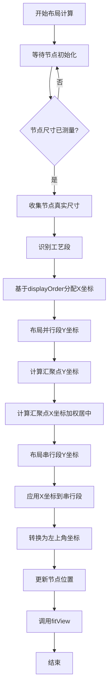
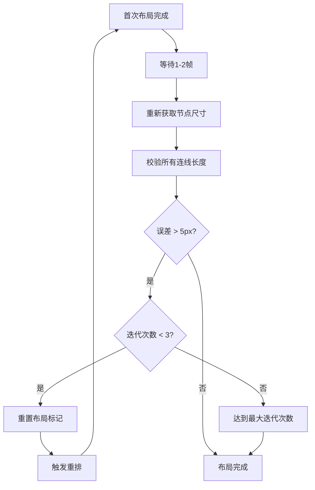
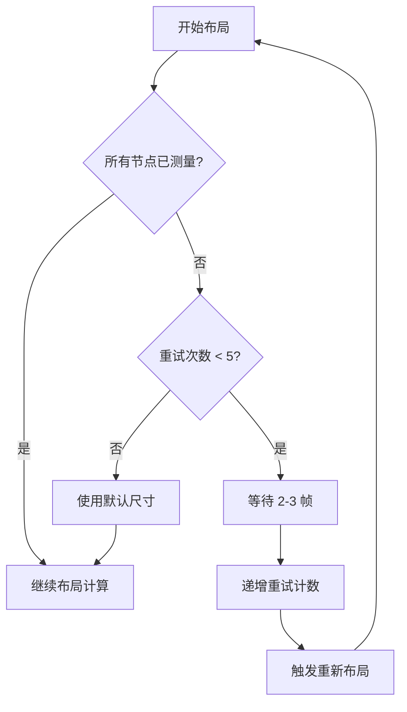

# 自动布局算法详细文档

## 目录

1. [概述](#概述)
2. [实现状态总览](#实现状态总览)
3. [技术路线](#技术路线)
4. [算法架构](#算法架构)
5. [核心算法详解](#核心算法详解)
6. [节点尺寸计算](#节点尺寸计算)
7. [精确高度计算](#精确高度计算)
8. [调试模式](#调试模式)
9. [数据存储格式](#数据存储格式)
10. [代码实现细节](#代码实现细节)
11. [性能优化](#性能优化)
12. [实现状态说明](#实现状态说明)

---

## 概述

本系统实现了一个智能的工艺流程图自动布局算法，用于自动计算和排列配方工艺流程图中的节点位置。算法采用**工艺段识别 + 分段布局**的策略，能够处理复杂的并行-串行混合流程，确保连线长度均匀、视觉美观。

### 核心特性

- ✅ **工艺段自动识别**：自动识别并行工艺段和串行工艺段
- ✅ **分段布局计算**：并行段和串行段采用不同的布局策略
- ✅ **固定连线长度**：确保所有连线长度统一（目标值：120px）
- ⚠️ **节点尺寸计算**：使用 React Flow 自动测量的真实尺寸（非 Canvas API）
- ✅ **分档宽度策略**：根据输入数量动态计算节点宽度（在 CustomNode 中实现）
- ✅ **水平对齐优化**：基于 `displayOrder` 的水平对齐
- ✅ **汇聚点智能居中**：多输入节点的加权居中算法
- ✅ **调试模式**：可视化显示连线长度和误差，快速定位布局问题

---

## 实现状态总览

| 功能模块 | 实现状态 | 说明 |
|---------|---------|------|
| **工艺段识别** | ✅ 已实现 | `segmentIdentifier.ts` - 使用 DFS 算法识别并行/串行段 |
| **并行段布局** | ✅ 已实现 | `layoutParallelSegments` - 按工艺类型分组对齐 |
| **萃取类自适应压缩** | ✅ 已实现 | `calculateExtractionEdgeLength` - 节点越多间距越小 |
| **串行段布局** | ✅ 已实现 | `layoutSerialSegments` - 从汇聚点向下排列 |
| **汇聚点Y坐标计算** | ✅ 已实现 | `calculateConvergenceY` - 支持 max/weighted/median 策略 |
| **汇聚点X坐标居中** | ✅ 已实现 | 加权质心算法，基于子树规模的**平方根** |
| **布局吸附机制** | ✅ 已实现 | 汇聚点自动吸附到入边源节点X坐标 |
| **圆角可行性检查** | ✅ 已实现 | 确保连线有足够水平空间画圆角 |
| **基于 displayOrder 的水平布局** | ✅ 已实现 | 每个 Process 分配一个水平车道 |
| **分档宽度计算** | ✅ 已实现 | `CustomNode.tsx` 中的 `getTieredWidth` 函数 |
| **节点尺寸获取** | ✅ 已实现 | 使用 React Flow 自动测量的 `node.width` 和 `node.height` |
| **测量重试机制** | ✅ 已实现 | 最多重试5次，避免使用未测量的尺寸 |
| **调试模式** | ✅ 已实现 | `DebugOverlay.tsx` 和 `DebugStatsPanel.tsx` |

---

## 技术路线

### 技术栈

| 技术 | 版本 | 用途 |
|------|------|------|
| **React Flow** | 11.11.0 | 流程图渲染引擎（提供节点尺寸自动测量） |
| **TypeScript** | 5.2.2 | 类型安全 |
| **Zustand** | 4.5.0 | 状态管理 |
| **React Hooks** | - | 响应式布局计算（useLayoutEffect, useNodesInitialized） |

**注意**：文档中提到的 Dagre 库未在代码中使用。水平布局直接基于 `displayOrder` 计算，不依赖图形布局算法库。

### 算法流程



---

## 算法架构

### 模块划分

```
src/components/graph/
├── LayoutController.tsx      # 主布局控制器（入口，Headless Component）
├── RecipeFlow.tsx            # React Flow 组件（集成布局控制器）
├── DebugOverlay.tsx          # 调试叠加层组件
└── DebugStatsPanel.tsx       # 调试统计面板

src/hooks/
├── segmentIdentifier.ts      # 工艺段识别算法
└── segmentLayoutCalculator.ts # 分段布局计算器

src/components/graph/
└── CustomNode.tsx            # 自定义节点组件（包含分档宽度计算）
```

### 数据流

```mermaid
sequenceDiagram
    participant RecipeFlow as RecipeFlow
    participant LayoutCtrl as LayoutController
    participant ReactFlow as React Flow
    participant Identifier as segmentIdentifier
    participant Calculator as segmentLayoutCalculator

    RecipeFlow->>LayoutCtrl: 内容变化触发布局
    LayoutCtrl->>ReactFlow: 等待节点初始化（useNodesInitialized）
    ReactFlow-->>LayoutCtrl: 节点尺寸已测量（node.width, node.height）
    LayoutCtrl->>Identifier: 识别工艺段
    Identifier-->>LayoutCtrl: 并行段 + 串行段
    LayoutCtrl->>Calculator: 布局并行段
    Calculator-->>LayoutCtrl: 并行段Y坐标
    LayoutCtrl->>Calculator: 计算汇聚点Y
    Calculator-->>LayoutCtrl: 汇聚点Y坐标
    LayoutCtrl->>LayoutCtrl: 基于 displayOrder 分配X坐标
    LayoutCtrl->>LayoutCtrl: 计算汇聚点X坐标（加权居中）
    LayoutCtrl->>Calculator: 布局串行段
    Calculator-->>LayoutCtrl: 串行段Y坐标
    LayoutCtrl->>LayoutCtrl: 转换为左上角坐标
    LayoutCtrl->>ReactFlow: 更新节点位置（setNodes）
    LayoutCtrl->>ReactFlow: 调用 fitView
    LayoutCtrl->>RecipeFlow: 通知布局完成
```



### 关键设计决策

1. **Headless Component 模式**：`LayoutController` 不渲染任何 UI，仅负责布局计算
2. **等待节点尺寸测量**：使用 React Flow 的 `useNodesInitialized` 确保节点尺寸已测量
3. **坐标系统**：内部使用中心点坐标计算，最后转换为左上角坐标（React Flow 要求）
4. **布局触发**：基于内容变化触发器（`layoutTrigger`），包含工艺段ID、子步骤ID、展开状态

---

## 核心算法详解

### 1. 工艺段识别算法 (`segmentIdentifier.ts`)

#### 算法原理

工艺段识别采用**深度优先搜索（DFS）**策略，从起点节点开始遍历，直到遇到汇聚点或终点。

#### 识别规则

1. **起点节点**：入度为 0 的节点
2. **汇聚点**：入度 > 1 的节点（多个分支汇聚）
3. **并行工艺段**：从起点到汇聚点之间的路径
4. **串行工艺段**：汇聚点之后的连续节点序列

#### 完整实现代码

```typescript
export function identifyProcessSegments(
  nodes: FlowNode[],
  edges: RecipeEdge[]
): SegmentIdentificationResult {
  // 1. 构建图结构（邻接表）
  const nodeMap = new Map<string, FlowNode>();
  nodes.forEach(node => nodeMap.set(node.id, node));

  const outgoingEdges = new Map<string, RecipeEdge[]>();
  const incomingEdges = new Map<string, RecipeEdge[]>();

  edges.forEach(edge => {
    if (!outgoingEdges.has(edge.source)) {
      outgoingEdges.set(edge.source, []);
    }
    outgoingEdges.get(edge.source)!.push(edge);

    if (!incomingEdges.has(edge.target)) {
      incomingEdges.set(edge.target, []);
    }
    incomingEdges.get(edge.target)!.push(edge);
  });

  // 2. 找到所有起点节点（入度为0）
  const startNodes = nodes.filter(node => {
    const incoming = incomingEdges.get(node.id) || [];
    return incoming.length === 0;
  });

  // 3. 找到汇聚点（入度 > 1 的节点）
  const convergenceNodes = nodes.filter(node => {
    const incoming = incomingEdges.get(node.id) || [];
    return incoming.length > 1;
  });

  // 如果只有一个汇聚点，使用它；否则选择第一个
  const convergenceNode = convergenceNodes.length > 0 ? convergenceNodes[0] : null;

  // 4. 从每个起点开始DFS，构建并行工艺段
  const parallelSegments: ProcessSegment[] = [];
  const visited = new Set<string>();

  startNodes.forEach((startNode, index) => {
    if (visited.has(startNode.id)) return;

    const segmentNodes: FlowNode[] = [];
    const segmentNodeIds = new Set<string>();

    // DFS遍历，直到遇到汇聚点或终点
    function dfs(currentNodeId: string): void {
      if (visited.has(currentNodeId)) return;
      if (segmentNodeIds.has(currentNodeId)) return; // 防止循环

      const currentNode = nodeMap.get(currentNodeId);
      if (!currentNode) return;

      // 如果当前节点是汇聚点，停止遍历
      if (convergenceNode && currentNodeId === convergenceNode.id) {
        return;
      }

      segmentNodes.push(currentNode);
      segmentNodeIds.add(currentNodeId);
      visited.add(currentNodeId);

      // 继续遍历出边
      const outgoing = outgoingEdges.get(currentNodeId) || [];
      for (const edge of outgoing) {
        const targetId = edge.target;
        
        // 如果目标节点是汇聚点，停止遍历
        if (convergenceNode && targetId === convergenceNode.id) {
          continue;
        }

        // 如果目标节点已经有入边（且不是当前边），说明是汇聚点，停止
        const targetIncoming = incomingEdges.get(targetId) || [];
        if (targetIncoming.length > 1) {
          continue;
        }

        dfs(targetId);
      }
    }

    dfs(startNode.id);

    if (segmentNodes.length > 0) {
      parallelSegments.push({
        id: `parallel-segment-${index}`,
        nodes: segmentNodes,
        isParallel: true,
        startNodeId: segmentNodes[0].id,
        endNodeId: segmentNodes[segmentNodes.length - 1].id,
      });
    }
  });

  // 5. 识别串行工艺段（汇聚点之后的节点）
  const serialSegments: ProcessSegment[] = [];
  
  if (convergenceNode) {
    const serialNodes: FlowNode[] = [convergenceNode];
    const serialNodeIds = new Set<string>([convergenceNode.id]);

    // 从汇聚点开始，找到所有后续节点
    function collectSerialNodes(nodeId: string): void {
      const outgoing = outgoingEdges.get(nodeId) || [];
      
      for (const edge of outgoing) {
        const targetId = edge.target;
        
        if (serialNodeIds.has(targetId)) continue;

        const targetNode = nodeMap.get(targetId);
        if (!targetNode) continue;

        // 如果目标节点有多个入边，说明是另一个汇聚点，停止
        const targetIncoming = incomingEdges.get(targetId) || [];
        if (targetIncoming.length > 1 && targetId !== convergenceNode.id) {
          continue;
        }

        serialNodes.push(targetNode);
        serialNodeIds.add(targetId);
        collectSerialNodes(targetId);
      }
    }

    collectSerialNodes(convergenceNode.id);

    // 将串行节点分组为工艺段（连续的节点为一个段）
    if (serialNodes.length > 1) {
      let currentSegment: FlowNode[] = [serialNodes[0]];
      
      for (let i = 1; i < serialNodes.length; i++) {
        const prevNode = serialNodes[i - 1];
        const currentNode = serialNodes[i];
        
        // 检查是否有直接连接
        const hasDirectEdge = edges.some(
          e => e.source === prevNode.id && e.target === currentNode.id
        );

        if (hasDirectEdge) {
          currentSegment.push(currentNode);
        } else {
          // 开始新段
          if (currentSegment.length > 0) {
            serialSegments.push({
              id: `serial-segment-${serialSegments.length}`,
              nodes: currentSegment,
              isParallel: false,
              startNodeId: currentSegment[0].id,
              endNodeId: currentSegment[currentSegment.length - 1].id,
            });
          }
          currentSegment = [currentNode];
        }
      }

      // 添加最后一个段
      if (currentSegment.length > 0) {
        serialSegments.push({
          id: `serial-segment-${serialSegments.length}`,
          nodes: currentSegment,
          isParallel: false,
          startNodeId: currentSegment[0].id,
          endNodeId: currentSegment[currentSegment.length - 1].id,
        });
      }
    }
  }

  return {
    parallelSegments,
    convergenceNode,
    serialSegments,
  };
}
```

#### 识别结果结构

```typescript
interface ProcessSegment {
  id: string;              // 段ID，如 "parallel-segment-0"
  nodes: FlowNode[];       // 该段的所有节点
  isParallel: boolean;     // 是否在并行区域
  startNodeId: string;     // 起始节点ID
  endNodeId: string;       // 结束节点ID
}
```

---

### 2. 分段布局计算器 (`segmentLayoutCalculator.ts`)

#### 2.1 并行段布局

**目标**：实现智能的并行段布局，具备以下特性：

- **按工艺类型分组对齐**：同类型段的起点Y坐标相同
- **组间Y偏移**：短类型整体下移，让各组末端更接近
- **萃取类自适应压缩**：子步骤越多，段内间距越小

```typescript
export function layoutParallelSegments(
  segments: ProcessSegment[],
  nodeHeights: Record<string, number>,
  config: ParallelLayoutConfig
): Record<string, number> {
  const nodeYPositions: Record<string, number> = {};

  // 步骤1: 按工艺类型分组
  const segmentsByType = new Map<ProcessType | 'unknown', ProcessSegment[]>();
  segments.forEach(segment => {
    const segmentType = getSegmentType(segment);
    if (!segmentsByType.has(segmentType)) {
      segmentsByType.set(segmentType, []);
    }
    segmentsByType.get(segmentType)!.push(segment);
  });

  // 步骤2: 计算每个段的相对布局和边距
  interface SegmentLayoutInfo {
    segment: ProcessSegment;
    segmentType: ProcessType | 'unknown';
    edgeLength: number;
    relativePositions: Record<string, number>;
    lastNodeBottom: number;
  }

  const segmentLayouts: SegmentLayoutInfo[] = [];
  
  segments.forEach(segment => {
    const segmentType = getSegmentType(segment);
    const nodeCount = segment.nodes.length;
    
    // 计算边距：萃取类使用自适应公式，其他类型使用固定值
    let edgeLength: number;
    if (segmentType === ProcessTypes.EXTRACTION) {
      edgeLength = calculateExtractionEdgeLength(nodeCount, config.targetEdgeLength);
    } else {
      edgeLength = config.targetEdgeLength;
    }
    
    // 计算相对布局（假设 startY=0）
    const { relativePositions, lastNodeBottom } = calculateRelativeLayout(
      segment,
      nodeHeights,
      edgeLength
    );
    
    segmentLayouts.push({ segment, segmentType, edgeLength, relativePositions, lastNodeBottom });
  });

  // 步骤3: 计算每个类型组的 span（组内最大 lastNodeBottom）
  const groupSpans = new Map<ProcessType | 'unknown', number>();
  segmentsByType.forEach((typeSegments, type) => {
    const maxSpan = Math.max(
      ...typeSegments.map(seg => {
        const layout = segmentLayouts.find(l => l.segment.id === seg.id);
        return layout ? layout.lastNodeBottom : 0;
      })
    );
    groupSpans.set(type, maxSpan);
  });

  // 步骤4: 计算全局最大 span
  const globalMaxSpan = Math.max(...Array.from(groupSpans.values()));

  // 步骤5: 确定每组 startY（组内头部对齐，组间偏移让末端接近）
  const groupStartYs = new Map<ProcessType | 'unknown', number>();
  const baseStartY = config.initialY;
  
  segmentsByType.forEach((_typeSegments, type) => {
    const groupSpan = groupSpans.get(type) || 0;
    // 短组下移：groupStartY = baseStartY + (globalMaxSpan - groupSpan)
    const groupStartY = baseStartY + (globalMaxSpan - groupSpan);
    groupStartYs.set(type, groupStartY);
  });

  // 步骤6: 应用偏移，写入最终位置
  segmentLayouts.forEach(({ segment, segmentType, relativePositions }) => {
    const groupStartY = groupStartYs.get(segmentType) || baseStartY;
    
    segment.nodes.forEach(node => {
      const relativeY = relativePositions[node.id];
      nodeYPositions[node.id] = groupStartY + relativeY;
    });
  });

  return nodeYPositions;
}
```

#### 2.1.1 萃取类自适应边距计算

萃取类工艺段通常包含较多子步骤，使用自适应公式压缩间距：

```typescript
/**
 * 计算萃取段的自适应边距长度
 * 
 * 公式: edgeLen(n) = clamp(base * s * sqrt(3 / max(n, 3)), minEdge, base)
 * 
 * @param nodeCount 段内节点数量
 * @param base 基础边距（默认 120）
 * @param scale 缩放因子（默认 0.96，让 n=4 时约等于 100）
 * @param minEdge 最小边距（默认 70，防止太挤）
 * @returns 计算后的边距长度
 */
function calculateExtractionEdgeLength(
  nodeCount: number,
  base: number = 120,
  scale: number = 0.96,
  minEdge: number = 70
): number {
  const effectiveN = Math.max(nodeCount, 3);
  const rawEdge = base * scale * Math.sqrt(3 / effectiveN);
  return Math.max(minEdge, Math.min(rawEdge, base));
}
```

**边距计算示例**：

| 节点数 | 计算边距 | 说明 |
|-------|---------|------|
| 1-3 | 120px | 使用默认边距 |
| 4 | ~100px | 开始压缩 |
| 6 | ~85px | 中等压缩 |
| 9+ | 70px | 最小边距 |

**布局示意图**：

```
溶解类段1:  [Node1] ──120px── [Node2]
           ↑ startY = 80 + offset

溶解类段2:  [Node3] ──120px── [Node4] ──120px── [Node5]
           ↑ startY = 80 + offset (与段1对齐)

萃取类段1:  [Node6] ──85px── [Node7] ──85px── [Node8] ──85px── [Node9]
           ↑ startY = 80 (更多节点，更小间距)
```

#### 2.2 汇聚点Y坐标计算

**策略**：支持三种策略，默认采用 `max` 策略，取所有并行段终点的最大Y坐标。

```typescript
export function calculateConvergenceY(
  parallelSegments: ProcessSegment[],
  nodeYPositions: Record<string, number>,
  nodeHeights: Record<string, number>,
  targetEdgeLength: number,
  strategy: ConvergenceStrategy = 'max'
): number {
  if (parallelSegments.length === 0) {
    return 80; // 默认值
  }

  // 计算每个并行段的终点Y坐标（段最后一个节点的底部 + 连线长度）
  const endYs = parallelSegments.map(seg => {
    const lastNode = seg.nodes[seg.nodes.length - 1];
    const lastNodeY = nodeYPositions[lastNode.id];
    const lastNodeHeight = nodeHeights[lastNode.id] || 120;
    
    // 终点Y = 节点中心Y + 节点高度的一半 + 连线长度
    return lastNodeY + lastNodeHeight / 2 + targetEdgeLength;
  });

  switch (strategy) {
    case 'max':
      return Math.max(...endYs);  // 推荐：所有入边都向下

    case 'weighted': {
      // 根据工艺段长度加权
      const totalSteps = parallelSegments.reduce((sum, seg) => sum + seg.nodes.length, 0);
      if (totalSteps === 0) return Math.max(...endYs);

      let weightedSum = 0;
      parallelSegments.forEach((seg, idx) => {
        const weight = seg.nodes.length / totalSteps;
        weightedSum += endYs[idx] * weight;
      });

      return weightedSum;
    }

    case 'median': {
      // 取中位数
      const sorted = [...endYs].sort((a, b) => a - b);
      const mid = Math.floor(sorted.length / 2);
      return sorted.length % 2 === 0
        ? (sorted[mid - 1] + sorted[mid]) / 2
        : sorted[mid];
    }

    default:
      return Math.max(...endYs);
  }
}
```

**策略说明**：

- **`max`**（推荐）：所有入边都向下，符合视觉习惯，确保所有连线都从上方汇入
- **`weighted`**：根据工艺段长度加权，长段权重更大，适合需要平衡视觉重量的场景
- **`median`**：取所有分支终点的中位数，适合需要减少极端值影响的场景

#### 2.3 串行段布局

**目标**：从汇聚点开始，垂直向下排列，所有连线长度统一。

```typescript
export function layoutSerialSegments(
  segments: ProcessSegment[],
  startY: number,  // 汇聚点之后的起始Y
  nodeHeights: Record<string, number>,
  config: SerialLayoutConfig
): Record<string, number> {
  const nodeYPositions: Record<string, number> = {};
  let currentY = startY;
  
  segments.forEach(segment => {
    segment.nodes.forEach((node, idx) => {
      nodeYPositions[node.id] = currentY;
      
      if (idx < segment.nodes.length - 1) {
        const nextNode = segment.nodes[idx + 1];
        const spacing =
          nodeHeights[node.id] / 2 +
          config.targetEdgeLength +
          nodeHeights[nextNode.id] / 2;
        
        currentY += spacing;
      }
    });
  });
  
  return nodeYPositions;
}
```

---

## 节点尺寸计算

### 1. 宽度计算（分档策略）✅ 已实现

**实现位置**：`src/components/graph/CustomNode.tsx`

根据输入数量分档，在节点渲染时动态计算：

```typescript
/**
 * 根据输入数量计算分档宽度
 */
const getTieredWidth = (inputCount: number): number => {
  if (inputCount <= 2) return 200;  // 1-2个输入：200px
  if (inputCount <= 4) return 280;  // 3-4个输入：280px
  return 360;                        // 5个及以上：360px
};
```

**使用方式**：在 `CustomNode` 组件中，根据节点的输入边数量计算宽度：

```typescript
const inputCount = edges.filter(e => e.target === id).length;
const nodeWidth = getTieredWidth(inputCount);

// 应用到节点样式
<div style={{ minWidth: `${nodeWidth}px`, width: `${nodeWidth}px` }}>
  {/* 节点内容 */}
</div>
```

### 2. 高度计算 ⚠️ 实际实现方式

**实际实现**：使用 React Flow 自动测量的真实尺寸，而非 Canvas API。

**实现位置**：`src/components/graph/LayoutController.tsx`

```typescript
// React Flow 11 中节点尺寸存储在 node.width 和 node.height
// 等待 React Flow 自动测量节点尺寸
const nodes = getNodes() as FlowNode[];

// 收集真实尺寸（React Flow 测量的）
const nodeHeights: Record<string, number> = {};
const nodeWidths: Record<string, number> = {};
nodes.forEach(node => {
  // 未测量时使用默认值
  nodeHeights[node.id] = node.height || 120;
  nodeWidths[node.id] = node.width || 200;
});
```

**优势**：
- ✅ 使用实际渲染尺寸，无需估算
- ✅ 自动适应内容变化
- ✅ 支持动态内容（展开/折叠）

---

### 3. 水平布局优化

#### 4.1 基于 displayOrder 的水平对齐 ✅ 已实现

**实现位置**：`src/components/graph/LayoutController.tsx`

X坐标直接由 `displayOrder`（表格顺序）决定：

```typescript
// 每个 Process 分配一个水平"车道"
const PROCESS_LANE_WIDTH = 300; // 每个工艺段的水平车道宽度
const LANE_GAP = 64;            // 车道之间的间隙
const START_X = 150;            // 起始 X 偏移

// 根据 displayOrder 分组节点
const nodesByDisplayOrder: Record<number, FlowNode[]> = {};
nodes.forEach(node => {
  const displayOrder = node.data.displayOrder || 1;
  if (!nodesByDisplayOrder[displayOrder]) {
    nodesByDisplayOrder[displayOrder] = [];
  }
  nodesByDisplayOrder[displayOrder].push(node);
});

// 为每个 displayOrder 组分配 X 坐标（存储为中心点）
const displayOrders = Object.keys(nodesByDisplayOrder).map(Number).sort((a, b) => a - b);
displayOrders.forEach((displayOrder, laneIndex) => {
  const laneX = START_X + laneIndex * (PROCESS_LANE_WIDTH + LANE_GAP);
  nodesByDisplayOrder[displayOrder].forEach(node => {
    const width = nodeWidths[node.id] || 200;
    // 存储节点中心点：车道左边缘 + 节点宽度的一半
    nodePositions[node.id] = { x: laneX + width / 2, y: 0 };
  });
});
```

#### 4.2 汇聚点水平居中 ✅ 已实现

**实现位置**：`src/components/graph/LayoutController.tsx`

采用**加权质心算法**，基于子树规模的**平方根**加权（弱化长分支的影响，避免汇聚点过度偏向）：

```typescript
// 计算汇聚点 X 坐标 (加权质心法)
if (parallelSegments.length > 0) {
  let totalWeight = 0;
  let weightedXSum = 0;

  parallelSegments.forEach(segment => {
    // 过滤出已分配位置的节点
    const validNodes = segment.nodes.filter(n => nodePositions[n.id]);
    if (validNodes.length === 0) return;

    // 计算该分支的质心 X
    const segmentCentroidX = validNodes.reduce((sum, n) => 
      sum + nodePositions[n.id].x, 0
    ) / validNodes.length;

    // 权重 = 节点数量的平方根 (弱化长分支的影响)
    const weight = Math.sqrt(validNodes.length);

    weightedXSum += segmentCentroidX * weight;
    totalWeight += weight;
  });

  if (totalWeight > 0) {
    convergenceX = weightedXSum / totalWeight;
  }
}
```

#### 4.3 布局吸附机制 ✅ 已实现

当汇聚点与某入边源节点 X 坐标接近时，自动吸附对齐，同时确保圆角几何可行：

```typescript
// 布局吸附参数
const SNAP_THRESHOLD_SCREEN_PX = 24; // 屏幕像素阈值
const CORNER_RADIUS = 20;            // 圆角半径（与 SequenceEdge.tsx 保持一致）
const MIN_HORIZONTAL_DISTANCE = CORNER_RADIUS * 2; // 圆角可行性的最小水平距离

// 收集所有进入汇聚点的并行分支末节点X坐标
const incomingXs: number[] = [];
parallelSegments.forEach(segment => {
  if (segment.nodes.length > 0) {
    const lastNode = segment.nodes[segment.nodes.length - 1];
    const lastNodeX = nodePositions[lastNode.id]?.x;
    if (lastNodeX !== undefined) {
      incomingXs.push(lastNodeX);
    }
  }
});

if (incomingXs.length > 0) {
  // 获取当前缩放级别，将屏幕像素阈值转换为画布单位
  const viewport = getViewport();
  const zoom = viewport.zoom || 1;
  const snapThresholdWorld = SNAP_THRESHOLD_SCREEN_PX / zoom;

  // 找到与 convergenceX 最近的入边源节点X
  const xNearest = incomingXs.reduce((best, x) =>
    Math.abs(x - convergenceX) < Math.abs(best - convergenceX) ? x : best
  , incomingXs[0]);

  const distanceToNearest = Math.abs(convergenceX - xNearest);
  
  if (distanceToNearest < snapThresholdWorld) {
    // 在阈值内：考虑吸附
    if (distanceToNearest < MIN_HORIZONTAL_DISTANCE) {
      // 距离不足以画圆角，调整到满足最小距离的位置
      convergenceX = convergenceX > xNearest 
        ? xNearest + MIN_HORIZONTAL_DISTANCE 
        : xNearest - MIN_HORIZONTAL_DISTANCE;
    } else {
      // 距离足够，安全吸附
      convergenceX = xNearest;
    }
  } else {
    // 超过阈值：检查是否满足圆角可行性
    const problematicEdges = incomingXs.filter(x => 
      Math.abs(x - convergenceX) < MIN_HORIZONTAL_DISTANCE
    );
    
    if (problematicEdges.length > 0) {
      // 调整 convergenceX 以满足最小距离要求
      const problematicX = problematicEdges.reduce((worst, x) => 
        Math.abs(x - convergenceX) < Math.abs(worst - convergenceX) ? x : worst
      , problematicEdges[0]);
      
      convergenceX = convergenceX > problematicX
        ? problematicX + MIN_HORIZONTAL_DISTANCE
        : problematicX - MIN_HORIZONTAL_DISTANCE;
    }
  }
}
```

**吸附机制示意图**：

```
吸附前:                          吸附后:
  [Node1]    [Node2]               [Node1]    [Node2]
     |          |                     |          |
     ↓          ↓                     ↓          ↓
  ──○────────○──                   ──────○───────
       ↓                                 ↓
  [Convergence]                    [Convergence]
  (X偏离理想位置)                    (X吸附到Node2的X)
```

**串行段对齐**：串行段的节点 X 坐标与汇聚点对齐：

```typescript
// 应用 X 坐标到串行段 (与汇聚点垂直对齐)
if (convergenceX > 0) {
  serialSegments.forEach(segment => {
    segment.nodes.forEach(node => {
      if (nodePositions[node.id]) {
        nodePositions[node.id].x = convergenceX;
      }
    });
  });
}
```

---

### 5. 布局配置参数

```typescript
const LAYOUT_CONFIG = {
  // 基础尺寸
  baseNodeWidth: 200,
  baseNodeHeight: 120,
  baseRankSep: 180,              // 基础层间距
  extraSpacingPerInput: 30,     // 每个额外输入增加的间距
  minNodeSep: 100,               // 最小节点间距
  
  // 分档宽度配置
  widthTiers: {
    tier1: { maxInputs: 2, width: 200 },
    tier2: { maxInputs: 4, width: 280 },
    tier3: { maxInputs: Infinity, width: 360 }
  },
  
  // 内容换行估算参数
  charWidth: 8,                  // 每个字符平均宽度（px）
  lineHeight: 20,                // 每行文本高度（px）
  minContentWidth: 150,          // 内容区域最小宽度
  
  // 工艺段布局参数
  targetEdgeLength: 120,        // 目标连线长度（固定值）
  convergenceStrategy: 'max',     // 汇聚点处理策略
  
  // 水平布局参数
  PROCESS_LANE_WIDTH: 300,      // 每个工艺段的水平车道宽度
  LANE_GAP: 64,                  // 车道之间的间隙
  START_X: 150,                  // 起始 X 偏移
  
  // 优化选项
  enableWeightedCentering: true, // 是否启用加权居中
  centeringStrategy: 'subtree-size', // 居中策略
};
```

---

## 精确高度计算

### 实际实现方式 ⚠️

**注意**：文档中描述的 Canvas API 精确测量方法**未在代码中实现**。当前实现使用 React Flow 的自动尺寸测量。

### 当前实现：React Flow 自动测量

**实现位置**：`src/components/graph/LayoutController.tsx`

系统使用 React Flow 11 的自动尺寸测量功能，在节点渲染后自动获取真实尺寸：

```typescript
// 等待 React Flow 自动测量所有节点的真实尺寸
const nodesInitialized = useNodesInitialized();

useLayoutEffect(() => {
  // 条件1: 节点已初始化（React Flow 已测量尺寸）
  if (!nodesInitialized) {
    return;
  }

  const nodes = getNodes() as FlowNode[];
  
  // React Flow 11 中节点尺寸存储在 node.width 和 node.height
  const nodeHeights: Record<string, number> = {};
  const nodeWidths: Record<string, number> = {};
  nodes.forEach(node => {
    // 未测量时使用默认值
    nodeHeights[node.id] = node.height || 120;
    nodeWidths[node.id] = node.width || 200;
  });
  
  // 使用真实尺寸进行布局计算
  // ...
}, [nodesInitialized, getNodes]);
```

### 优势

- ✅ **真实尺寸**：使用实际渲染尺寸，无需估算
- ✅ **自动适应**：自动适应内容变化（展开/折叠、动态内容）
- ✅ **无需维护**：不需要手动计算文字换行和高度

---

## 调试模式

### 功能概述

调试模式提供可视化工具，实时显示连线长度和误差，帮助快速定位布局问题。

### 启用方式

**方法1：UI 开关**
- 点击流程图右上角的调试按钮
- 按钮状态：🔴 调试: 开 / ⚪ 调试: 关

**方法2：控制台**
```javascript
localStorage.setItem('debug_layout', 'true');  // 开启
localStorage.setItem('debug_layout', 'false'); // 关闭
```

### 显示内容

#### 1. 连线长度标注

每条连线旁边显示：
- **实际长度**：例如 `120.3px`
- **误差标注**：误差 > 0.5px 时显示 `(Δ+0.3)`

#### 2. 颜色编码

根据误差大小使用不同颜色：

| 颜色 | 误差范围 | 说明 |
|------|---------|------|
| 🟢 **绿色** | < 5px | 误差很小，布局良好 |
| 🟡 **黄色** | 5-10px | 误差中等，可优化 |
| 🔴 **红色** | > 10px | 误差较大，需要检查 |

#### 3. 悬停提示

鼠标悬停在标签上显示详细信息：
```
目标: 120px, 误差: 0.3px
```

### 实现细节

**组件位置**：`src/components/graph/DebugOverlay.tsx`

**核心逻辑**：

```typescript
// 计算每条连线的实际长度
const sourceBottom = sourceCenterY + sourceHeight / 2;
const targetTop = targetCenterY - targetHeight / 2;
const actualLength = targetTop - sourceBottom;

// 计算误差
const error = Math.abs(actualLength - targetEdgeLength);

// 确定颜色
let color: 'green' | 'yellow' | 'red' = 'green';
if (error > 10) color = 'red';
else if (error > 5) color = 'yellow';
```

**坐标计算**：
- 使用节点中心坐标（而非左上角）
- 考虑视口变换（zoom, pan）
- 标签位置在连线中点

### 使用场景

1. **布局验证**：检查连线长度是否统一
2. **问题定位**：快速找到误差较大的连线
3. **算法调优**：根据误差数据调整布局参数
4. **性能分析**：统计整体误差分布

### 数据统计

控制台输出布局验证统计：

```javascript
[Layout] 布局验证: {
  parallelSegments: [
    {
      segmentId: "parallel-segment-0",
      avgEdgeLength: "120.2",
      stdDeviation: "1.5",  // 标准差
      minEdgeLength: "118.5",
      maxEdgeLength: "122.1"
    }
  ],
  overall: {
    avgParallelEdgeLength: "120.1",
    avgSerialEdgeLength: "119.8"
  }
}
```

**目标指标**：
- 标准差 < 3px（当前约 8-12px，改进后预期 < 3px）
- 平均误差 < 2px

### 实现细节

**组件位置**：`src/components/graph/DebugOverlay.tsx`

**核心逻辑**：

```typescript
// 计算每条连线的实际长度
const sourceBottom = sourceCenterY + sourceHeight / 2;
const targetTop = targetCenterY - targetHeight / 2;
const actualLength = targetTop - sourceBottom;

// 计算误差
const error = Math.abs(actualLength - targetEdgeLength);

// 确定颜色
let color: 'green' | 'yellow' | 'red' = 'green';
if (error > 10) color = 'red';
else if (error > 5) color = 'yellow';
```

**节点调试信息**：

调试模式还会显示每个节点的尺寸和位置信息：

```typescript
const nodeDebugInfos = nodes.map(node => {
  const height = node.height!;
  const width = node.width!;
  const centerX = node.position.x + width / 2;
  const centerY = node.position.y + height / 2;
  
  return {
    id: node.id,
    x: node.position.x + width, // 右上角
    y: node.position.y,
    width,
    height,
    centerX,
    centerY,
    topY: node.position.y,
    bottomY: node.position.y + height,
  };
});
```

**坐标计算**：
- 使用节点中心坐标（而非左上角）进行计算
- 考虑视口变换（zoom, pan）
- 标签位置在连线中点

### 统计面板

**组件位置**：`src/components/graph/DebugStatsPanel.tsx`

统计面板显示布局验证的统计信息：

- **并行工艺段统计**：每个并行段的节点数、边数、平均长度、标准差、最小/最大长度
- **串行工艺段统计**：串行段的边数、平均长度、标准差、最小/最大长度
- **总体统计**：并行边总数、串行边总数、并行平均长度、串行平均长度

**实现逻辑**：

```typescript
const layoutValidation = validateSegmentLayout(
  parallelSegments,
  serialSegments,
  nodePositions,
  nodeHeights,
  120 // TARGET_EDGE_LENGTH
);
```

---

## 走廊路由机制

### 概述

当多条连线汇入同一节点时，使用走廊路由（Corridor Routing）避免连线交叉，提高可读性。

### 实现位置

**组件位置**：`src/components/graph/SequenceEdge.tsx`

### 路由判断

```typescript
// 判断是否使用走廊路由
const incomingTotal = data?.incomingTotal;
const useCorridor = incomingTotal !== undefined && incomingTotal > 1;
```

当目标节点的入边总数 > 1 时，启用走廊路由。

### 路径生成

走廊路由采用三段式路径：**垂直下降 → 水平移动 → 垂直上升**，并带有圆角过渡。

```typescript
function generateCorridorPath(
  sourceX: number,
  sourceY: number,
  targetX: number,
  targetY: number
): string {
  // 走廊参数
  const CORRIDOR_CLEARANCE_PX = 60; // 走廊距离目标节点的净空
  const MIN_TARGET_CLEARANCE_PX = 24; // 最小目标节点净空
  const MIN_SOURCE_DROP_PX = 12; // 最小源节点下降距离
  const CORNER_RADIUS = 20; // 拐角圆角半径

  // 计算走廊Y坐标
  let corridorY = targetY - CORRIDOR_CLEARANCE_PX;
  
  // 夹紧条件1：确保走廊不压住目标节点
  const minCorridorY = targetY - MIN_TARGET_CLEARANCE_PX;
  corridorY = Math.min(corridorY, minCorridorY);
  
  // 夹紧条件2：确保有足够的下降距离
  const minSourceY = sourceY + MIN_SOURCE_DROP_PX;
  corridorY = Math.max(corridorY, minSourceY);
  
  // 如果源点已经在目标点下方，使用简单的垂直路径
  if (sourceY >= targetY) {
    return `M ${sourceX} ${sourceY} L ${targetX} ${targetY}`;
  }
  
  // 计算水平移动方向
  const horizontalDistance = Math.abs(targetX - sourceX);
  
  // 如果水平距离很小，使用简单的垂直路径
  if (horizontalDistance < CORNER_RADIUS * 2) {
    return `M ${sourceX} ${sourceY} L ${targetX} ${targetY}`;
  }
  
  // 生成三段式路径（带圆角）
  // 1. 从源点垂直下降到走廊（留出圆角空间）
  const verticalDropEndY = corridorY - CORNER_RADIUS;
  
  // 2. 圆角过渡到水平段
  const isTargetRight = targetX > sourceX;
  const cornerX1 = isTargetRight 
    ? sourceX + CORNER_RADIUS 
    : sourceX - CORNER_RADIUS;
  
  // 3. 水平移动到目标X附近（留出圆角空间）
  const cornerX2 = isTargetRight 
    ? targetX - CORNER_RADIUS 
    : targetX + CORNER_RADIUS;
  
  // 4. 圆角过渡到垂直段
  const verticalRiseStartY = corridorY + CORNER_RADIUS;
  
  // 构建完整路径
  const path = [
    `M ${sourceX} ${sourceY}`,                    // 起点
    `L ${sourceX} ${verticalDropEndY}`,           // 垂直下降
    `Q ${sourceX} ${corridorY} ${cornerX1} ${corridorY}`, // 圆角1
    `L ${cornerX2} ${corridorY}`,                 // 水平移动
    `Q ${targetX} ${corridorY} ${targetX} ${verticalRiseStartY}`, // 圆角2
    `L ${targetX} ${targetY}`,                    // 垂直上升
  ].join(' ');
  
  return path;
}
```

### 路径示意图

```
源节点 (sourceX, sourceY)
    |
    | 垂直下降
    |
    └─┐ 圆角1
      |
      | 水平移动（走廊）
      |
    ┌─┘ 圆角2
    |
    | 垂直上升
    |
目标节点 (targetX, targetY)
```

### 优势

- ✅ **避免交叉**：多条连线通过走廊水平对齐，避免交叉
- ✅ **视觉清晰**：所有汇入连线在同一水平线上，易于识别
- ✅ **平滑过渡**：使用圆角过渡，视觉效果更好

---

## 重排迭代机制

### 概述

首次布局后，节点尺寸可能发生变化（React Flow 重新测量），导致连线长度不准确。重排迭代机制自动校验间距，必要时重新布局。

### 实现位置

**实现位置**：`src/components/graph/LayoutController.tsx`

### 迭代流程



### 实现代码

```typescript
const TARGET_EDGE_LENGTH = 120;
const TOLERANCE = 5; // 允许误差 5px
const MAX_ITERATIONS = 3; // 最多重排 3 次

// 等待 1-2 帧让 ReactFlow 完成重新测量
window.requestAnimationFrame(() => {
  window.requestAnimationFrame(() => {
    // 重新获取节点（可能已重新测量尺寸）
    const currentNodes = getNodes() as FlowNode[];
    const currentEdges = getEdges() as RecipeEdge[];

    // 校验边间距
    let maxError = 0;
    let invalidEdgeCount = 0;

    currentEdges.forEach(edge => {
      const sourceNode = currentNodes.find(n => n.id === edge.source);
      const targetNode = currentNodes.find(n => n.id === edge.target);

      if (!sourceNode || !targetNode) {
        return;
      }

      // 使用默认尺寸，与布局计算阶段保持一致
      const sourceHeight = sourceNode.height || 120;

      // 计算实际间距
      const sourceBottom = sourceNode.position.y + sourceHeight;
      const targetTop = targetNode.position.y;
      const actualGap = targetTop - sourceBottom;
      const error = Math.abs(actualGap - TARGET_EDGE_LENGTH);

      if (error > TOLERANCE) {
        invalidEdgeCount++;
        maxError = Math.max(maxError, error);
      }
    });

    console.log('[LayoutController] 间距校验:', {
      iteration: layoutIterationRef.current,
      totalEdges: currentEdges.length,
      invalidEdges: invalidEdgeCount,
      maxError: maxError.toFixed(1),
      tolerance: TOLERANCE,
    });

    // 判断是否需要重排
    const needsRelayout = invalidEdgeCount > 0 && layoutIterationRef.current < MAX_ITERATIONS;

    if (needsRelayout) {
      console.log(`[LayoutController] 间距不合格，触发第 ${layoutIterationRef.current + 1} 次重排`);
      layoutIterationRef.current++;
      // 重置布局标记，通过 state 触发下一轮布局
      hasLayoutedRef.current = false;
      setRelayoutTrigger(prev => prev + 1); // 触发重排
      return;
    }

    // 间距合格或达到最大迭代次数，完成布局
    if (layoutIterationRef.current >= MAX_ITERATIONS && invalidEdgeCount > 0) {
      console.warn('[LayoutController] 达到最大迭代次数，停止重排（部分边间距可能仍不合格）');
    } else {
      console.log('[LayoutController] 间距校验通过，布局完成');
    }

    // 标记已布局
    hasLayoutedRef.current = true;
    layoutIterationRef.current = 0; // 重置迭代次数

    // 执行 fitView
    fitView({ padding: 0.2, duration: 0 });
    onLayoutComplete();
  });
});
```

### 迭代参数

| 参数 | 值 | 说明 |
|------|-----|------|
| `TARGET_EDGE_LENGTH` | 120px | 目标连线长度 |
| `TOLERANCE` | 5px | 允许误差范围 |
| `MAX_ITERATIONS` | 3 | 最大迭代次数 |

### 优势

- ✅ **自动修正**：自动检测并修正布局误差
- ✅ **防止无限循环**：最多迭代3次，避免无限重排
- ✅ **容错机制**：即使达到最大迭代次数，也会完成布局

---

## 节点尺寸处理

### 概述

节点尺寸处理是布局算法的关键环节。系统使用 React Flow 自动测量的真实尺寸，而非估算值。

### React Flow 自动测量

**实现位置**：`src/components/graph/LayoutController.tsx`

React Flow 11 在节点渲染后自动测量节点尺寸，存储在 `node.width` 和 `node.height` 中。

```typescript
// 等待 React Flow 自动测量所有节点的真实尺寸
const nodesInitialized = useNodesInitialized();

useLayoutEffect(() => {
  // 条件1: 节点已初始化（React Flow 已测量尺寸）
  if (!nodesInitialized) {
    return;
  }

  const nodes = getNodes() as FlowNode[];
  
  // React Flow 11 中节点尺寸存储在 node.width 和 node.height
  const nodeHeights: Record<string, number> = {};
  const nodeWidths: Record<string, number> = {};
  nodes.forEach(node => {
    // 未测量时使用默认值
    nodeHeights[node.id] = node.height || 120;
    nodeWidths[node.id] = node.width || 200;
  });
  
  // 使用真实尺寸进行布局计算
  // ...
}, [nodesInitialized, getNodes]);
```

### 默认值处理

当节点尺寸未测量时，使用默认值：

```typescript
// 检查节点尺寸（放宽条件：允许部分节点未测量，使用默认尺寸继续布局）
const measuredNodes = nodes.filter(n => n.width && n.height);
const unmeasuredNodes = nodes.filter(n => !n.width || !n.height);

if (unmeasuredNodes.length > 0) {
  console.warn('[LayoutController] 部分节点尺寸未测量，使用默认尺寸:',
    unmeasuredNodes.map(n => n.id)
  );
}

// 使用默认值
nodes.forEach(node => {
  nodeHeights[node.id] = node.height || 120;  // 默认高度 120px
  nodeWidths[node.id] = node.width || 200;     // 默认宽度 200px
});
```

### 测量重试机制 ✅ 已实现

当所有节点尺寸都未测量时（可能是 React Flow 临时清空），系统会延迟重试而不是使用默认尺寸：

```typescript
const MAX_MEASUREMENT_RETRIES = 5; // 最多重试 5 次

// 如果所有节点都未测量，延迟重试
if (measuredNodes.length === 0 && nodes.length > 0) {
  if (measurementRetryRef.current < MAX_MEASUREMENT_RETRIES) {
    console.warn(`[LayoutController] 所有节点尺寸未测量，延迟重试 (${measurementRetryRef.current + 1}/${MAX_MEASUREMENT_RETRIES})`);
    measurementRetryRef.current++;
    
    // 延迟 2-3 帧后重试
    measurementRetryTimeoutRef.current = window.requestAnimationFrame(() => {
      window.requestAnimationFrame(() => {
        measurementRetryTimeoutRef.current = null;
        // 通过递增 relayoutTrigger 触发重试
        setRelayoutTrigger(prev => prev + 1);
      });
    });
    return; // 不继续布局，等待重试
  } else {
    console.warn('[LayoutController] 达到最大测量重试次数，使用默认尺寸继续布局');
    measurementRetryRef.current = 0;
  }
}
```

**重试机制流程**：



**参数说明**：

| 参数 | 值 | 说明 |
|------|-----|------|
| `MAX_MEASUREMENT_RETRIES` | 5 | 最大重试次数 |
| 重试间隔 | 2-3 帧 | 使用 `requestAnimationFrame` 嵌套 |

### 优势

- ✅ **真实尺寸**：使用实际渲染尺寸，无需估算
- ✅ **自动适应**：自动适应内容变化（展开/折叠、动态内容）
- ✅ **无需维护**：不需要手动计算文字换行和高度
- ✅ **容错机制**：未测量时使用默认值，保证布局不中断
- ✅ **智能重试**：避免在 React Flow 临时清空尺寸时使用错误数据

### 与 Canvas API 的对比

**注意**：文档中描述的 Canvas API 精确测量方法（`measureTextHeight`, `wrapText`）**未在代码中实现**。当前实现依赖 React Flow 的自动尺寸测量。

**原因**：React Flow 的自动尺寸测量已经提供了准确的节点尺寸，无需手动计算。

---

## 常见问题和解决方案

### 问题1：布局抖动

**症状**：页面刷新或内容变化时，节点位置发生跳动。

**原因**：
- 节点位置缓存未正确更新
- 布局算法在节点尺寸未测量时执行

**解决方案**：
1. 确保使用 `layoutTrigger` 检测内容变化
2. 等待节点初始化完成后再执行布局
3. 使用 `hasLayoutedRef` 防止重复布局

```typescript
// 等待节点初始化
if (!nodesInitialized) {
  return;
}

// 检查是否已布局过
if (hasLayoutedRef.current) {
  return;
}
```

### 问题2：位置丢失

**症状**：某些节点位置为 (0, 0) 或未分配位置。

**原因**：
- 节点未正确分配到工艺段
- 位置计算逻辑遗漏某些节点

**解决方案**：
1. 检查并处理完全没有位置的节点
2. 为缺失节点分配默认位置

```typescript
// 检查并处理完全没有位置的节点
const nodesWithoutPosition = nodes.filter(n => !nodePositions[n.id]);
if (nodesWithoutPosition.length > 0) {
  console.warn('[LayoutController] 发现未分配位置的节点:',
    nodesWithoutPosition.map(n => n.id)
  );

  // 为缺失节点分配默认位置
  nodesWithoutPosition.forEach(node => {
    const displayOrder = node.data.displayOrder || 1;
    const laneIndex = displayOrders.indexOf(displayOrder);
    const laneX = laneIndex >= 0
      ? START_X + laneIndex * (PROCESS_LANE_WIDTH + LANE_GAP)
      : START_X;
    const width = nodeWidths[node.id] || 200;
    nodePositions[node.id] = { x: laneX + width / 2, y: INITIAL_Y };
  });
}
```

### 问题3：连线重叠

**症状**：多条连线汇入同一节点时重叠。

**原因**：
- 未启用走廊路由
- Handle 分配不正确

**解决方案**：
1. 确保 `incomingTotal` 正确传递
2. 启用走廊路由机制
3. 正确分配 `targetHandle`

```typescript
// 在 useFlowEdges 中设置 incomingTotal
edges.forEach(edge => {
  const incomingEdges = nodeIncomingEdges.get(edge.target) || [];
  flowEdges.push({
    ...edge,
    data: {
      ...edge.data,
      incomingTotal: incomingEdges.length,
    },
  });
});
```

### 问题4：连线长度不准确

**症状**：连线长度与目标值（120px）偏差较大。

**原因**：
- 节点尺寸在布局后发生变化
- 首次布局时节点尺寸未完全测量

**解决方案**：
1. 启用重排迭代机制
2. 增加迭代次数或调整容差

```typescript
const TOLERANCE = 5; // 允许误差 5px
const MAX_ITERATIONS = 3; // 最多重排 3 次
```

### 问题5：性能问题

**症状**：布局计算耗时过长，页面卡顿。

**原因**：
- 节点数量过多
- 布局计算未优化

**解决方案**：
1. 使用 `useMemo` 缓存计算结果
2. 使用 `React.memo` 避免不必要的重渲染
3. 批量更新节点位置

```typescript
// 使用 useMemo 缓存
export const useFlowNodes = (): FlowNode[] => {
  return useMemo(() => {
    // 计算节点...
  }, [processes, expandedProcesses, nodePositions]);
};

// 使用 memo 避免重渲染
export const CustomNode = memo(({ ... }: NodeProps) => {
  // ...
});
```

---

## 数据存储格式

### 1. 内存数据结构（Zustand Store）

```typescript
interface RecipeStore {
  // 主数据结构
  processes: Process[];           // 工艺段列表
  edges: RecipeEdge[];           // 工艺段间连线
  metadata: {
    name: string;
    version: string;
    updatedAt: string;
  };
  
  // UI状态
  hoveredNodeId: string | null;
  selectedNodeId: string | null;
  expandedProcesses: Set<string>; // 展开的工艺段ID集合
  
  // 布局缓存
  nodePositions: Record<string, { x: number; y: number }>; // 节点位置缓存
  nodeHeights: Record<string, number>; // 节点高度缓存（用于调试）
  nodeWidths: Record<string, number>; // 节点宽度缓存（用于调试）
  
  // 版本控制
  version: number;               // 乐观锁版本号
  isSaving: boolean;             // 保存状态
}
```

### 2. 数据库存储格式（SQLite）

#### 表结构

```sql
CREATE TABLE recipes (
  id TEXT PRIMARY KEY,              -- 配方ID（默认 'default'）
  metadata TEXT NOT NULL,           -- JSON字符串：{ name, version, updatedAt }
  processes TEXT NOT NULL,          -- JSON字符串：Process[] 数组
  edges TEXT NOT NULL,              -- JSON字符串：RecipeEdge[] 数组
  version INTEGER DEFAULT 1,        -- 乐观锁版本号
  updated_at TEXT NOT NULL,         -- ISO 8601 时间戳
  updated_by TEXT                   -- 最后更新用户ID
);
```

#### JSON 数据格式

**Process 结构**：

```json
{
  "id": "P1",
  "name": "糖醇、三氯蔗糖类溶解液",
  "description": "可选描述",
  "node": {
    "id": "P1",
    "type": "processNode",
    "label": "糖醇、三氯蔗糖类溶解液",
    "subSteps": [
      {
        "id": "P1-substep-1",
        "order": 1,
        "processType": "dissolution",
        "label": "溶解",
        "deviceCode": "高搅桶1",
        "ingredients": "糖醇、三氯蔗糖",
        "params": {
          "processType": "dissolution",
          "dissolutionParams": {
            "waterVolumeMode": "ratio",
            "waterRatio": { "min": 5, "max": 8 },
            "waterTemp": { "min": 60, "max": 80, "unit": "℃" },
            "stirringTime": { "value": 30, "unit": "min" },
            "stirringRate": "high",
            "transferType": "material"
          }
        }
      }
    ]
  }
}
```

**RecipeEdge 结构**：

```json
{
  "id": "e_P1-P6",
  "source": "P1",
  "target": "P6",
  "type": "sequenceEdge",
  "data": {
    "sequenceOrder": 1
  },
  "animated": true
}
```

**完整 RecipeSchema**：

```json
{
  "metadata": {
    "name": "饮料生产工艺配方",
    "version": "1.0.0",
    "updatedAt": "2024-01-15T10:30:00.000Z"
  },
  "processes": [
    { /* Process 对象 */ },
    { /* Process 对象 */ }
  ],
  "edges": [
    { /* RecipeEdge 对象 */ },
    { /* RecipeEdge 对象 */ }
  ]
}
```

### 3. 节点位置和尺寸存储

**注意**：节点位置、高度、宽度**不存储在数据库中**，仅保存在内存中的缓存中。每次加载配方时，由布局算法重新计算。

```typescript
// 内存中的布局缓存
nodePositions: {
  "P1": { x: 150, y: 80 },
  "P1-substep-1": { x: 150, y: 200 },
  "P2": { x: 514, y: 80 },
  // ...
}

nodeHeights: {
  "P1": 120,
  "P1-substep-1": 180,  // 精确计算的高度
  "P2": 120,
  // ...
}

nodeWidths: {
  "P1": 200,
  "P1-substep-1": 200,
  "P2": 280,  // 根据输入数量分档
  // ...
}
```

**用途**：
- `nodePositions`：React Flow 渲染节点位置
- `nodeHeights`：调试模式计算连线长度
- `nodeWidths`：调试模式计算节点中心坐标

---

## 代码实现细节

### 1. 主布局控制器 (`LayoutController.tsx`) ✅ 已实现

**实现位置**：`src/components/graph/LayoutController.tsx`

#### 触发条件

布局计算在以下情况触发：

1. **节点初始化完成**：使用 `useNodesInitialized` 等待 React Flow 测量节点尺寸
2. **内容变化**：通过 `layoutTrigger` prop 检测内容变化（工艺段ID、子步骤ID、展开状态）
3. **首次布局**：使用 `hasLayoutedRef` 确保只布局一次
4. **重排迭代**：通过 `relayoutTrigger` state 触发重排

#### layoutTrigger 生成逻辑

`layoutTrigger` 是一个字符串签名，用于检测内容变化：

```typescript
// 内容变化触发器 - 用于检测需要重新布局的情况
// 只包含影响布局的信息：工艺段ID、子步骤ID、展开状态
const layoutTrigger = useMemo(() => {
  const processIds = processes.map(p => p.id).join(',');
  const subStepIds = processes.flatMap(p => p.node.subSteps.map(s => s.id)).join(',');
  const expandedIds = Array.from(expandedProcesses).sort().join(',');
  
  return `${processIds}|${subStepIds}|${expandedIds}`;
}, [processes, expandedProcesses]);
```

**触发机制**：

```typescript
// 内容变化时重置布局标记和迭代次数
if (layoutTrigger !== layoutTriggerRef.current) {
  hasLayoutedRef.current = false;
  layoutIterationRef.current = 0;
  layoutTriggerRef.current = layoutTrigger;
  setRelayoutTrigger(0); // 重置触发器
}
```

#### 布局流程

```typescript
export function LayoutController({ onLayoutComplete, onNodesUpdate, layoutTrigger }: LayoutControllerProps) {
  const { getNodes, setNodes, getEdges, fitView } = useReactFlow();
  const nodesInitialized = useNodesInitialized();
  const hasLayoutedRef = useRef(false);

  useLayoutEffect(() => {
    // 1. 等待节点初始化（React Flow 已测量尺寸）
    if (!nodesInitialized) return;
    
    // 2. 检查是否已布局过
    if (hasLayoutedRef.current) return;

    const nodes = getNodes() as FlowNode[];
    const edges = getEdges() as RecipeEdge[];

    // 3. 收集真实尺寸（React Flow 测量的）
    const nodeHeights: Record<string, number> = {};
    const nodeWidths: Record<string, number> = {};
    nodes.forEach(node => {
      nodeHeights[node.id] = node.height || 120;
      nodeWidths[node.id] = node.width || 200;
    });

    // 4. 识别工艺段
    const { parallelSegments, serialSegments, convergenceNode } = 
      identifyProcessSegments(nodes, edges);

    // 5. 基于 displayOrder 分配 X 坐标（存储为中心点）
    const nodePositions: Record<string, { x: number; y: number }> = {};
    const nodesByDisplayOrder: Record<number, FlowNode[]> = {};
    // ... 分组和分配 X 坐标逻辑

    // 6. 布局并行段（计算 Y 坐标）
    const parallelYPositions = layoutParallelSegments(
      parallelSegments,
      nodeHeights,
      { targetEdgeLength: 120, initialY: 80 }
    );

    // 7. 计算汇聚点位置 (X 和 Y)
    let convergenceY = 80;
    let convergenceX = 0;
    if (convergenceNode) {
      convergenceY = calculateConvergenceY(
        parallelSegments,
        parallelYPositions,
        nodeHeights,
        120,
        'max'
      );
      // 计算汇聚点 X 坐标（加权质心法）
      // ...
    }

    // 8. 布局串行段
    const serialYPositions = layoutSerialSegments(
      serialSegments,
      convergenceY + (convergenceNode ? nodeHeights[convergenceNode.id] || 120 : 0),
      nodeHeights,
      { targetEdgeLength: 120 }
    );

    // 9. 应用 X 坐标到串行段（与汇聚点对齐）
    if (convergenceX > 0) {
      serialSegments.forEach(segment => {
        segment.nodes.forEach(node => {
          if (nodePositions[node.id]) {
            nodePositions[node.id].x = convergenceX;
          }
        });
      });
    }

    // 10. 合并 Y 坐标
    Object.keys(parallelYPositions).forEach(nodeId => {
      if (nodePositions[nodeId]) {
        nodePositions[nodeId].y = parallelYPositions[nodeId];
      }
    });
    Object.keys(serialYPositions).forEach(nodeId => {
      if (nodePositions[nodeId]) {
        nodePositions[nodeId].y = serialYPositions[nodeId];
      }
    });

    // 11. 转换为左上角坐标（React Flow 使用左上角）
    const layoutedNodes = nodes.map(node => {
      const pos = nodePositions[node.id];
      const width = nodeWidths[node.id] || 200;
      const height = nodeHeights[node.id] || 120;
      
      return {
        ...node,
        position: {
          x: pos.x - width / 2,  // 中心点 → 左上角
          y: pos.y - height / 2, // 中心点 → 左上角
        },
      };
    });

    // 12. 更新节点位置
    onNodesUpdate(layoutedNodes);
    setNodes(layoutedNodes);

    // 13. 调用 fitView 并通知完成
    window.requestAnimationFrame(() => {
      window.requestAnimationFrame(() => {
        fitView({ padding: 0.2, duration: 0 });
        hasLayoutedRef.current = true;
        onLayoutComplete();
      });
    });
  }, [nodesInitialized, getNodes, setNodes, getEdges, fitView, onLayoutComplete, onNodesUpdate]);

  return null; // Headless Component
}
```

#### 坐标系统

- **内部计算**：使用中心点坐标（`{ x: centerX, y: centerY }`）
- **最终输出**：转换为左上角坐标（React Flow 要求）
- **转换公式**：`左上角X = 中心X - 宽度/2`，`左上角Y = 中心Y - 高度/2`

### 2. React Flow 集成

#### 节点渲染

节点位置从 `nodePositions` 缓存中读取：

```typescript
export const useFlowNodes = (): FlowNode[] => {
  const nodePositions = useRecipeStore((state) => state.nodePositions);
  
  return useMemo(() => {
    const nodes: FlowNode[] = [];
    
    processes.forEach((process, index) => {
      const isExpanded = expandedProcesses.has(process.id);
      const displayOrder = index + 1;
      
      if (isExpanded) {
        // 展开模式：为每个子步骤创建节点
        process.node.subSteps.forEach((subStep) => {
          nodes.push({
            id: subStep.id,
            type: 'subStepNode',
            position: nodePositions[subStep.id] || { x: 0, y: 0 },
            data: { subStep, processId: process.id, displayOrder }
          });
        });
      } else {
        // 折叠模式：创建汇总节点
        nodes.push({
          id: process.id,
          type: 'processSummaryNode',
          position: nodePositions[process.id] || { x: 0, y: 0 },
          data: {
            processId: process.id,
            processName: process.name,
            subStepCount: process.node.subSteps.length,
            displayOrder
          }
        });
      }
    });
    
    return nodes;
  }, [processes, expandedProcesses, nodePositions]);
};
```

#### 边渲染

边的 `targetHandle` 和 `sourceHandle` 根据输入/输出数量动态分配：

```typescript
export const useFlowEdges = (): RecipeEdge[] => {
  return useMemo(() => {
    const flowEdges: RecipeEdge[] = [];
    
    // 1. 处理工艺段间连线
    edges.forEach(edge => {
      // 根据展开状态确定实际的 source/target 节点ID
      const sourceNodeId = sourceExpanded 
        ? sourceProcess.node.subSteps[sourceProcess.node.subSteps.length - 1].id
        : sourceProcess.id;
      const targetNodeId = targetExpanded
        ? targetProcess.node.subSteps[0].id
        : targetProcess.id;
      
      flowEdges.push({ ...edge, source: sourceNodeId, target: targetNodeId });
    });
    
    // 2. 处理工艺段内部连线（展开时）
    processes.forEach(process => {
      if (expandedProcesses.has(process.id) && process.node.subSteps.length > 1) {
        for (let idx = 0; idx < process.node.subSteps.length - 1; idx++) {
          flowEdges.push({
            id: `internal-${current.id}-${next.id}`,
            source: current.id,
            target: next.id,
            type: 'sequenceEdge',
            data: { sequenceOrder: 1 }
          });
        }
      }
    });
    
    // 3. 分配 targetHandle 和 sourceHandle
    return flowEdges.map(edge => {
      const incomingEdges = nodeIncomingEdges.get(edge.target) || [];
      let targetHandle: string | undefined;
      
      if (incomingEdges.length > 1) {
        const sortedInEdges = [...incomingEdges].sort((a, b) => 
          (a.data?.sequenceOrder || 0) - (b.data?.sequenceOrder || 0)
        );
        const handleIndex = sortedInEdges.findIndex(e => e.id === edge.id);
        if (handleIndex >= 0) targetHandle = `target-${handleIndex}`;
      }
      
      // sourceHandle 类似逻辑...
      
      return { ...edge, targetHandle, sourceHandle };
    });
  }, [processes, edges, expandedProcesses, nodePositions]);
};
```

---

## 性能优化

### 1. 缓存机制

#### 位置缓存

计算好的位置会实时更新到 `useRecipeStore` 的 `nodePositions` 缓存中，防止页面刷新抖动。

```typescript
// 在 RecipeFlow 中合并位置
useEffect(() => {
  setNodesState(prevNodesState => {
    // 创建位置映射表
    const positionMap = new Map(
      prevNodesState.map(n => [n.id, n.position])
    );
    
    // 合并：使用新的基础数据，但保留现有节点的位置
    const mergedNodes = baseNodes.map(baseNode => ({
      ...baseNode,
      position: positionMap.get(baseNode.id) ?? baseNode.position ?? { x: 0, y: 0 },
    }));
    
    return mergedNodes;
  });
}, [baseNodes]);
```

#### 签名比较

使用 `layoutTrigger` 字符串签名检测内容变化，避免不必要的重新计算：

```typescript
const layoutTrigger = useMemo(() => {
  const processIds = processes.map(p => p.id).join(',');
  const subStepIds = processes.flatMap(p => p.node.subSteps.map(s => s.id)).join(',');
  const expandedIds = Array.from(expandedProcesses).sort().join(',');
  
  return `${processIds}|${subStepIds}|${expandedIds}`;
}, [processes, expandedProcesses]);
```

**优势**：
- ✅ 字符串比较比对象深度比较更快
- ✅ 只包含影响布局的关键信息
- ✅ 避免因引用变化导致的误触发

### 2. 计算优化

#### 按需计算

只在数据变化时触发布局计算：

```typescript
// 内容变化时重置布局标记
if (layoutTrigger !== layoutTriggerRef.current) {
  hasLayoutedRef.current = false;
  layoutIterationRef.current = 0;
  layoutTriggerRef.current = layoutTrigger;
  setRelayoutTrigger(0);
}
```

#### 批量更新

所有位置计算完成后，一次性更新 Store：

```typescript
// 所有位置计算完成后，一次性更新
onNodesUpdate(layoutedNodes);
setNodes(layoutedNodes);
```

**优势**：
- ✅ 减少 React 重渲染次数
- ✅ 避免中间状态的闪烁
- ✅ 提高性能

### 3. React 优化

#### useMemo 缓存

`useFlowNodes` 和 `useFlowEdges` 使用 `useMemo` 缓存结果：

```typescript
export const useFlowNodes = (): FlowNode[] => {
  const nodePositions = useRecipeStore((state) => state.nodePositions);
  
  return useMemo(() => {
    const nodes: FlowNode[] = [];
    
    processes.forEach((process, index) => {
      const isExpanded = expandedProcesses.has(process.id);
      const displayOrder = index + 1;
      
      if (isExpanded) {
        // 展开模式：为每个子步骤创建节点
        process.node.subSteps.forEach((subStep) => {
          nodes.push({
            id: subStep.id,
            type: 'subStepNode',
            position: nodePositions[subStep.id] || { x: 0, y: 0 },
            data: { subStep, processId: process.id, displayOrder }
          });
        });
      } else {
        // 折叠模式：创建汇总节点
        nodes.push({
          id: process.id,
          type: 'processSummaryNode',
          position: nodePositions[process.id] || { x: 0, y: 0 },
          data: {
            processId: process.id,
            processName: process.name,
            subStepCount: process.node.subSteps.length,
            displayOrder
          }
        });
      }
    });
    
    return nodes;
  }, [processes, expandedProcesses, nodePositions]);
};
```

#### React.memo 避免重渲染

`CustomNode` 和 `SequenceEdge` 使用 `React.memo` 避免不必要的重渲染：

```typescript
export const CustomNode = memo(({ id, data, selected, type }: NodeProps<CustomNodeData>) => {
  // ...
});

export const SequenceEdge = memo(({ ... }: EdgeProps) => {
  // ...
});
```

**优势**：
- ✅ 减少不必要的组件重渲染
- ✅ 提高渲染性能
- ✅ 减少 CPU 占用

### 4. 布局算法优化

#### 真实尺寸测量

使用 React Flow 自动测量的节点尺寸，无需估算：

```typescript
// React Flow 11 中节点尺寸存储在 node.width 和 node.height
const nodeHeights: Record<string, number> = {};
const nodeWidths: Record<string, number> = {};
nodes.forEach(node => {
  nodeHeights[node.id] = node.height || 120;
  nodeWidths[node.id] = node.width || 200;
});
```

**优势**：
- ✅ 使用实际渲染尺寸，无需估算
- ✅ 自动适应内容变化
- ✅ 支持动态内容（展开/折叠）

#### 坐标系统优化

内部使用中心点坐标计算，最后转换为左上角坐标：

```typescript
// 内部计算：使用中心点坐标
nodePositions[node.id] = { x: laneX + width / 2, y: currentY };

// 最终输出：转换为左上角坐标（React Flow 要求）
position: {
  x: pos.x - width / 2,  // 中心点 → 左上角
  y: pos.y - height / 2, // 中心点 → 左上角
}
```

**优势**：
- ✅ 中心点坐标计算更直观
- ✅ 减少坐标转换错误
- ✅ 便于调试

#### 布局触发优化

基于内容变化触发器，避免不必要的重新计算：

```typescript
// 使用 useLayoutEffect 确保在 DOM 更新后执行
useLayoutEffect(() => {
  // 条件1: 节点已初始化
  if (!nodesInitialized) return;
  
  // 条件2: 还没有布局过
  if (hasLayoutedRef.current) return;
  
  // 执行布局计算...
}, [nodesInitialized, getNodes, setNodes, getEdges, fitView, onLayoutComplete, onNodesUpdate, relayoutTrigger]);
```

**优势**：
- ✅ 只在必要时执行布局计算
- ✅ 避免重复计算
- ✅ 提高性能

### 5. 调试模式优化

调试模式使用 `useMemo` 缓存计算结果，避免重复计算：

```typescript
const debugLabels = useMemo((): DebugLabel[] => {
  if (!enabled) return [];
  
  // 计算调试标签...
  return labels;
}, [enabled, edges, getNodes]);
```

**优势**：
- ✅ 只在调试模式启用时计算
- ✅ 缓存计算结果
- ✅ 减少性能开销

---

## 总结

本自动布局算法采用**工艺段识别 + 分段布局**的策略，能够：

1. ✅ 自动识别并行和串行工艺段
2. ✅ 确保连线长度统一（120px）
3. ✅ 使用 React Flow 自动测量的真实节点尺寸
4. ✅ 基于表格顺序（`displayOrder`）进行水平对齐
5. ✅ 智能处理汇聚点的居中（加权质心算法）
6. ✅ 提供调试模式可视化布局问题

算法具有良好的可扩展性和性能，能够处理复杂的工艺流程图形布局需求。

---

## 相关文件

### 核心布局文件

- `src/components/graph/LayoutController.tsx` - 主布局控制器（Headless Component）
- `src/components/graph/RecipeFlow.tsx` - React Flow 组件（集成布局控制器）
- `src/hooks/segmentIdentifier.ts` - 工艺段识别算法
- `src/hooks/segmentLayoutCalculator.ts` - 分段布局计算器

### 调试组件

- `src/components/graph/DebugOverlay.tsx` - 调试叠加层组件（显示连线长度）
- `src/components/graph/DebugStatsPanel.tsx` - 调试统计面板（显示布局统计）

### 节点组件

- `src/components/graph/CustomNode.tsx` - 自定义节点组件（包含分档宽度计算）

### 状态管理

- `src/store/useRecipeStore.ts` - 状态管理（包含节点位置缓存）

### 类型定义

- `src/types/recipe.ts` - 类型定义（FlowNode, RecipeEdge, ProcessSegment 等）

### 数据库

- `server/src/db.ts` - 数据库操作

---

## 实现状态说明

### 已实现功能 ✅

1. **工艺段识别**：完整实现，使用 DFS 算法识别并行和串行工艺段
2. **并行段布局**：完整实现，按工艺类型分组对齐，萃取类自适应压缩
3. **串行段布局**：完整实现，从汇聚点向下排列
4. **汇聚点计算**：完整实现，支持 Y 坐标（max/weighted/median 策略）和 X 坐标（加权质心，平方根权重）
5. **布局吸附机制**：完整实现，汇聚点自动吸附到入边源节点X坐标
6. **圆角可行性检查**：完整实现，确保连线有足够水平空间画圆角
7. **水平布局**：完整实现，基于 `displayOrder` 分配水平车道
8. **分档宽度**：完整实现，在 `CustomNode.tsx` 中根据输入数量计算
9. **节点尺寸获取**：完整实现，使用 React Flow 自动测量
10. **测量重试机制**：完整实现，最多重试5次
11. **调试模式**：完整实现，包括可视化叠加层和统计面板

### 实现差异说明

1. **布局入口**：
   - **文档描述**：`useAutoLayout.ts` hook
   - **实际实现**：`LayoutController.tsx` Headless Component
   - **原因**：需要在 React Flow 内部使用 `useReactFlow` 和 `useNodesInitialized`

2. **节点尺寸计算**：
   - **文档描述**：Canvas API 精确测量文字高度
   - **实际实现**：React Flow 自动测量的真实尺寸
   - **原因**：React Flow 11 提供了自动尺寸测量，更准确且无需维护

3. **坐标系统**：
   - **内部计算**：使用中心点坐标
   - **最终输出**：转换为左上角坐标（React Flow 要求）
   - **文档说明**：已更新以反映实际实现

---

## 更新日志

### 2026-01-12：文档全面更新

**更新内容**:
- ✅ 更新并行段布局算法描述，添加按工艺类型分组对齐策略
- ✅ 添加萃取类自适应边距压缩公式：`edgeLen(n) = clamp(base * s * sqrt(3 / max(n, 3)), minEdge, base)`
- ✅ 修正汇聚点X坐标权重公式为 `Math.sqrt(validNodes.length)`
- ✅ 添加布局吸附机制描述（吸附阈值、圆角可行性检查）
- ✅ 添加测量重试机制描述（最多5次重试）
- ✅ 更新实现状态总览表

**主要变更**:
- 并行段布局从"固定连线长度"更正为"按工艺类型分组对齐"
- 汇聚点X坐标权重从"节点数量"更正为"节点数量的平方根"
- 新增布局吸附机制章节（4.3节）
- 新增测量重试机制章节

### 2024-XX-XX：文档初始化

**更新内容**:
- ✅ 创建文档，描述自动布局算法的基本架构
- ✅ 添加工艺段识别算法详解
- ✅ 添加分段布局计算器描述
- ✅ 添加调试模式说明

