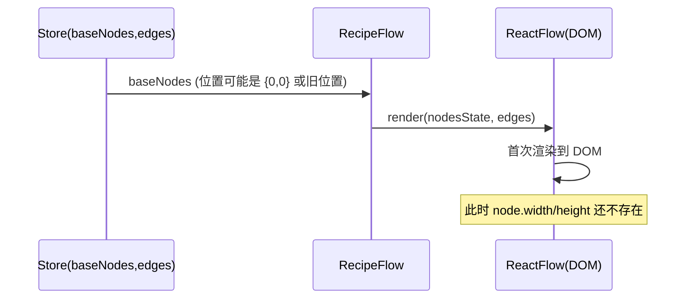
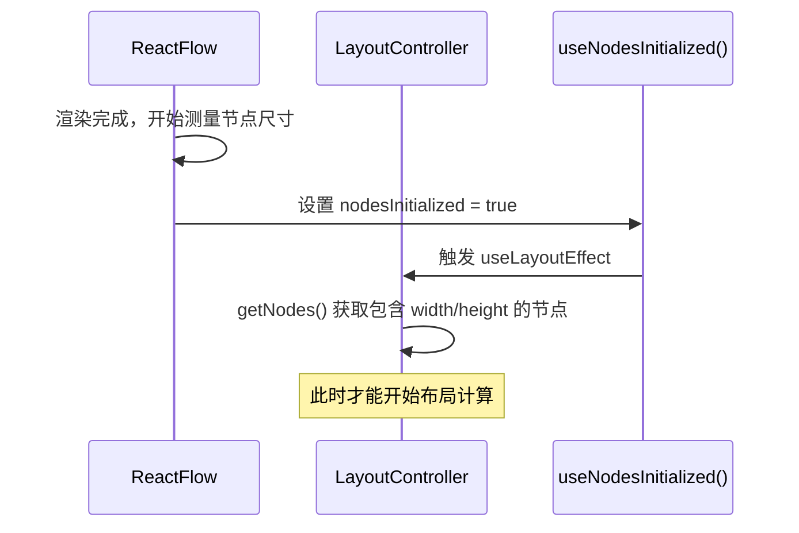
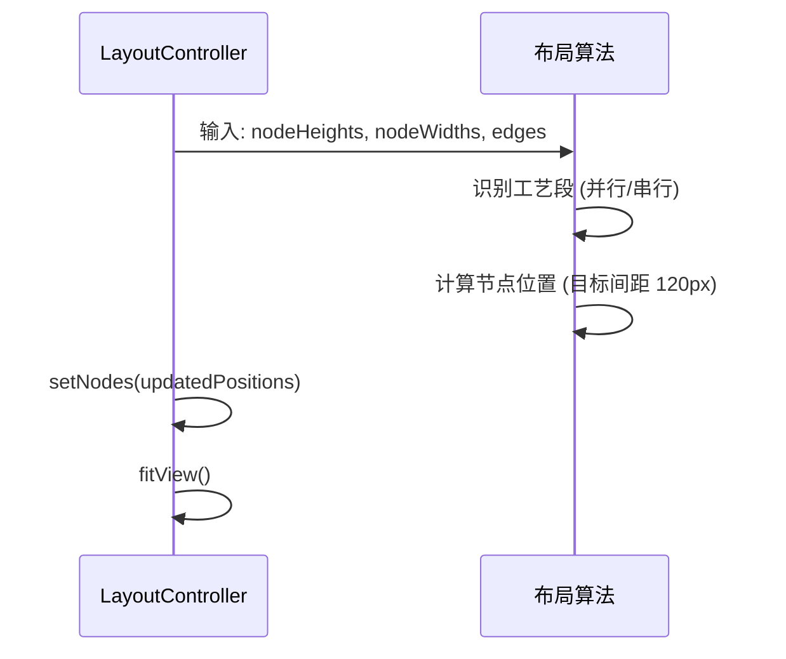
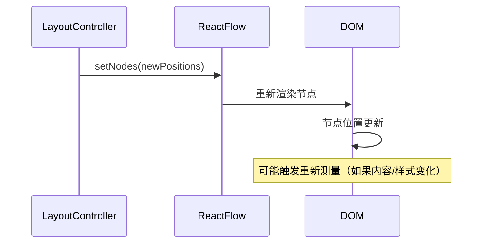
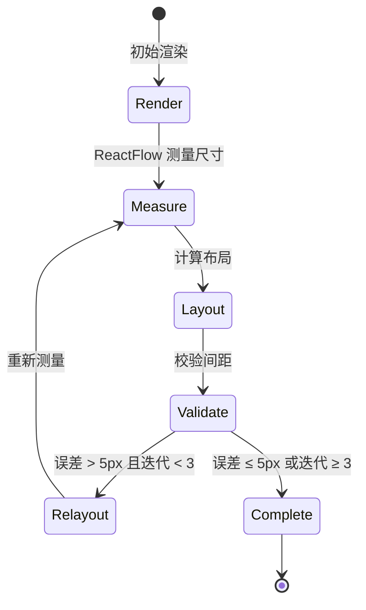

# 布局渲染管道：为什么数据稳定但布局仍会变化？

## 核心问题

你可能会困惑：**为什么我的数据（节点内容、边连接）都是稳定的，但布局算法算出来的间距还是会变化，甚至出现“循环重排”？**

答案是：**布局算法的输入不只是“数据”，还包括“DOM 测量得到的节点尺寸（width/height）”。数据稳定 ≠ 尺寸稳定。**

## 当前实现的真实时序

### 阶段 1: 初始渲染（数据 → DOM）



**关键点**：
- `baseNodes` 来自 store，包含节点内容（id、data、type），但位置可能是 `{0,0}` 或上次保存的位置。
- ReactFlow 首次渲染时，节点的 `width/height` 属性还不存在（ReactFlow 需要先渲染到 DOM 才能测量）。

### 阶段 2: 尺寸测量（DOM → 尺寸）



**关键点**：
- ReactFlow 在渲染完成后会自动测量每个节点的真实 DOM 尺寸，存储在 `node.width` 和 `node.height`。
- `LayoutController` 通过 `useNodesInitialized()` 等待这个测量完成。
- **这就是为什么需要“等待布局”**：不是算法算不出来，而是没有真实高度时算出来也不准。

### 阶段 3: 布局计算（尺寸 → 位置）



**关键点**：
- 布局算法使用**测量得到的尺寸**计算位置，目标是每条边的间距 = 120px。
- 计算完成后通过 `setNodes` 更新节点位置，并调用 `fitView` 调整视图。

### 阶段 4: 重新渲染（位置 → DOM）



**关键点**：
- 位置更新后，ReactFlow 会重新渲染节点。
- 如果节点内容、样式、或内部布局（如 handle 数量）发生变化，ReactFlow 可能会**重新测量**节点尺寸。

## 为什么尺寸会变化？（即使数据稳定）

### 1. React StrictMode（开发环境）

React 18 的 StrictMode 在开发环境下会**故意双调用**组件和某些 hook，以帮助发现副作用问题。

**影响**：
- 如果 `console.log` 写在 `useMemo`（渲染阶段）里，会看到重复输出。
- 某些计算可能会执行两次，但通常不会影响最终结果（因为 React 会丢弃第一次的结果）。

**解决方案**：
- 所有副作用（日志、校验输出）应该放在 `useEffect` 中。
- 使用 `useRef` 保存“签名”来去重，避免 StrictMode 下重复输出。

### 2. NodeInternalsUpdater 触发重新测量

```typescript
// RecipeFlow.tsx
function NodeInternalsUpdater({ nodes, edges }) {
  const updateNodeInternals = useUpdateNodeInternals();
  
  useEffect(() => {
    if (nodes.length > 0) {
      updateNodeInternals(nodes.map(n => n.id));
    }
  }, [edges, nodes]); // ← edges 变化时会触发
}
```

**影响**：
- 当 `edges` 或 `nodes` 变化时，`updateNodeInternals` 会触发 ReactFlow 重新计算节点的 handle 位置。
- 这可能导致节点内部布局变化，进而触发**重新测量尺寸**。

### 3. 字体加载/文本换行

**场景**：
- 初始渲染时字体可能还没加载完成，使用 fallback 字体。
- 字体加载完成后，同一段文本的宽度/高度可能变化。
- 容器宽度变化（窗口 resize）也会导致文本换行，改变节点高度。

**影响**：
- 即使节点内容（data）不变，DOM 测量得到的 `height` 可能不同。
- 布局算法用旧高度算的位置，在真实高度变化后，间距就会偏离目标值。

### 4. 内容异步渲染/动态变化

**场景**：
- 某些字段可能在首次渲染时是空值，后续异步填充。
- 国际化、单位转换、百分比格式化等，可能导致文本长度变化。

**影响**：
- 首次布局时用的高度，在内容填充后可能不准确。

## 当前实现的问题

### 问题 1: 只有校验，没有修正

**现状**：
- `DebugOverlay` 和 `validateSegmentLayout` 会计算每条边的实际间距，并输出校验结果。
- 但**没有任何逻辑会根据校验结果自动修正布局**。

**结果**：
- 当节点高度后续变化时，间距会偏离 120px，但不会自动调整。

### 问题 2: Debug 输出重复（StrictMode）

**现状**：
- `DebugOverlay` 的 `useMemo` 中直接调用 `console.group/log`。
- StrictMode 下会触发双调用，导致重复输出。

**结果**：
- 控制台看到两组完全相同的验证日志，干扰判断。

### 问题 3: 布局超时未清理

**现状**：
- `RecipeFlow` 在 `layoutTrigger` 变化时设置 3 秒超时。
- 即使布局已完成，超时仍会触发 `setLayoutReady(true)`。

**结果**：
- 布局完成后仍会触发一次额外的 re-render，可能误导日志。

## 正确的架构：验证驱动重排闭环

### 状态机设计



### 关键约束

1. **渲染阶段无副作用**：所有日志/校验输出放到 `useEffect`，避免 StrictMode 双调用。
2. **重排有上限**：最多 3 次迭代，避免死循环。
3. **容差阈值**：允许误差 ≤ 5px，避免因微小抖动反复重排。

### 实现要点

#### 1. 尺寸稳定等待（可选优化）

在开始布局前，可以等待尺寸稳定：

```typescript
// 等待尺寸稳定（连续 2 帧一致）
let lastSizes: Record<string, { w: number; h: number }> = {};
let stableFrames = 0;
const MAX_WAIT_FRAMES = 10;

function waitForStableSizes() {
  return new Promise<void>((resolve) => {
    function check() {
      const nodes = getNodes();
      const currentSizes: Record<string, { w: number; h: number }> = {};
      nodes.forEach(n => {
        if (n.width && n.height) {
          currentSizes[n.id] = { w: n.width, h: n.height };
        }
      });
      
      // 检查是否与上次一致
      const isStable = Object.keys(currentSizes).every(id => {
        const last = lastSizes[id];
        return last && 
               Math.abs(last.w - currentSizes[id].w) < 1 &&
               Math.abs(last.h - currentSizes[id].h) < 1;
      });
      
      if (isStable && stableFrames >= 1) {
        resolve();
      } else {
        lastSizes = currentSizes;
        stableFrames = isStable ? stableFrames + 1 : 0;
        if (stableFrames < MAX_WAIT_FRAMES) {
          requestAnimationFrame(check);
        } else {
          resolve(); // 超时也继续
        }
      }
    }
    requestAnimationFrame(check);
  });
}
```

#### 2. 校验驱动重排

在布局完成后，校验间距，不合格则重排：

```typescript
// 校验边间距
function validateEdgeGaps(
  nodes: FlowNode[],
  edges: RecipeEdge[],
  targetLength: number,
  tolerance: number
): { isValid: boolean; maxError: number } {
  let maxError = 0;
  
  edges.forEach(edge => {
    const source = nodes.find(n => n.id === edge.source);
    const target = nodes.find(n => n.id === edge.target);
    if (!source || !target || !source.height || !target.height) return;
    
    const sourceBottom = source.position.y + source.height;
    const targetTop = target.position.y;
    const actualGap = targetTop - sourceBottom;
    const error = Math.abs(actualGap - targetLength);
    
    maxError = Math.max(maxError, error);
  });
  
  return {
    isValid: maxError <= tolerance,
    maxError
  };
}

// 在布局完成后校验
const validation = validateEdgeGaps(layoutedNodes, edges, 120, 5);
if (!validation.isValid && layoutIteration < 3) {
  // 触发重排
  layoutIteration++;
  hasLayoutedRef.current = false; // 重置标记，触发下一轮布局
} else {
  // 完成布局
  fitView();
  onLayoutComplete();
}
```

## 常见坑与最佳实践

### ❌ 错误：在渲染阶段做副作用

```typescript
// ❌ 错误：useMemo 中调用 console.log
const debugLabels = useMemo(() => {
  // ... 计算
  console.log('[Debug] 验证'); // ← StrictMode 下会输出两次
  return labels;
}, [deps]);
```

### ✅ 正确：在 effect 中做副作用

```typescript
// ✅ 正确：useMemo 只做纯计算
const debugLabels = useMemo(() => {
  // ... 计算
  return labels;
}, [deps]);

// useEffect 中输出日志，并去重
const lastSignatureRef = useRef<string>('');
useEffect(() => {
  if (!enabled || debugLabels.length === 0) return;
  
  const signature = debugLabels.map(l => `${l.id}:${l.value.toFixed(1)}`).join('|');
  if (signature === lastSignatureRef.current) return; // 去重
  
  lastSignatureRef.current = signature;
  console.group('[Debug] 连线长度验证');
  debugLabels.forEach(label => {
    console.log(/* ... */);
  });
  console.groupEnd();
}, [enabled, debugLabels]);
```

### ❌ 错误：布局超时未清理

```typescript
// ❌ 错误：超时在布局完成后仍会触发
useEffect(() => {
  setLayoutReady(false);
  const timeoutId = setTimeout(() => {
    setLayoutReady(true); // ← 即使布局已完成也会触发
  }, 3000);
  return () => clearTimeout(timeoutId);
}, [layoutTrigger]);
```

### ✅ 正确：布局完成时清理超时

```typescript
// ✅ 正确：用 ref 保存 timeoutId，布局完成时清理
const timeoutRef = useRef<NodeJS.Timeout | null>(null);

useEffect(() => {
  setLayoutReady(false);
  timeoutRef.current = setTimeout(() => {
    if (!layoutReady) { // 检查是否已完成
      console.warn('[RecipeFlow] 布局超时，强制显示');
      setLayoutReady(true);
    }
  }, 3000);
  return () => {
    if (timeoutRef.current) {
      clearTimeout(timeoutRef.current);
      timeoutRef.current = null;
    }
  };
}, [layoutTrigger]);

const onLayoutComplete = useCallback(() => {
  if (timeoutRef.current) {
    clearTimeout(timeoutRef.current);
    timeoutRef.current = null;
  }
  setLayoutReady(true);
}, []);
```

### ❌ 错误：无限重排

```typescript
// ❌ 错误：没有迭代上限
function layout() {
  // ... 布局计算
  const validation = validateEdgeGaps(/* ... */);
  if (!validation.isValid) {
    layout(); // ← 可能死循环
  }
}
```

### ✅ 正确：有上限的重排

```typescript
// ✅ 正确：记录迭代次数，最多 3 次
const layoutIterationRef = useRef(0);

function layout() {
  if (layoutIterationRef.current >= 3) {
    console.warn('[LayoutController] 达到最大迭代次数，停止重排');
    return;
  }
  
  // ... 布局计算
  const validation = validateEdgeGaps(/* ... */);
  if (!validation.isValid) {
    layoutIterationRef.current++;
    layout(); // 最多 3 次
  } else {
    layoutIterationRef.current = 0; // 重置
  }
}
```

## 总结

1. **数据稳定 ≠ 尺寸稳定**：节点尺寸来自 DOM 测量，受字体、换行、ReactFlow internals 等影响。
2. **等待布局等的不是算法**：等的是 ReactFlow 完成尺寸测量。
3. **需要验证驱动重排闭环**：校验间距，不合格时自动重排（有上限）。
4. **渲染阶段无副作用**：所有日志/校验输出放到 `useEffect`，避免 StrictMode 重复输出。
5. **布局超时要清理**：布局完成时清理超时，避免误导性日志。

通过实现验证驱动重排闭环，可以确保布局在节点尺寸变化后自动收敛到目标间距（120px ± 5px）。

